# Automated Psychiatric Nosology via Representation-Learning-Based Partitioning of Knowledge Graph
## Table of Contents
- [Abstract](#abstract)
- [Background / Literature Review](#background--literature-review)
    - [Biomarkers of Psychopathology](#biomarkers-of-psychopathology)
    - [Transdiagnostic Dimensions](#transdiagnostic-dimensions)
    - [Automated Methods](#automated-methods)
    - [Conclusion](#conclusion)
- [Research Question](#research-question)
- [Hypothesis](#hypothesis)
    - [Hypothesis Metrics Justification](hypothesis-metrics-justification)
- [Methods](#methods)
    - [Graph Creation](#graph-creation)
    - [Knowledge Graph Dataset](#knowledge-graph-dataset)
    - [Preventing Biased Alignment](#preventing-biased-alignment)
    - [Partitioning](#partitioning)
        - [Encoder Architecture](#encoder-architecture)
        - [Decoder Architecture](#decoder-architecture)
        - [Training](#training)
            - [Commands](#commands)
            - [Mitigating Cluster Collapse and Runaway Imbalance](#mitigating-cluster-collapse-and-runaway-imbalance)
            - [Stabilizing Hard-Concrete Gates](#stabilizing-hard--concrete-gates)
            - [Gate Revival Hook](#gate-revival-hook)
            - [Controlling Message-Passing Drift](#controlling-message--passing-drift)
            - [Addressing Degree and Hub Bias](#addressing-degree-and-hub-bias)
            - [Balancing Multiplex Relation Frequencies](#balancing-multiplex-relation-frequencies)
            - [Hardening Negative Sampling](#hardening-negative-sampling)
            - [Maintaining Cross-Batch Consistency](#maintaining-cross--batch-consistency)
            - [Latent Regularization and Diagnostics](#latent-regularization-and-diagnostics)
            - [Trainer-Level Safeguards](#trainer--level-safeguards)
            - [Objective](#objective)
            - [Reconstruction Loss and Entropy Controls](#reconstruction-loss-and-entropy-controls)
        - [Adaptive Subgraph Sampling to Mitigate Overfitting](#adaptive-subgraph-sampling-to-mitigate-overfitting)
        - [Comparison](#comparison)
- [Results](#results)
    - [Baseline Psychiatric Label Coverage](#baseline-psychiatric-label-coverage)
    - [Overall Metrics](#overall-metrics)
    - [HiTOP Alignment Summary](#hitop-alignment-summary)
    - [RDoC Alignment Summary](#rdoc-alignment-summary)
    - [Stability Metrics (Bootstrapped Subgraph and Semantic Consistency)](#stability-metrics--bootstrapped-subgraph-and-semantic-consistency-)
    - [Training Dynamics](#training-dynamics)
        - [Calibration and Reconstruction Diagnostics](#calibration-and-reconstruction-diagnostics)
        - [Regularization Burden](#regularization-burden)
- [Discussion](#discussion)
- [Conclusion](#conclusion-1)
- [Abbreviations](#abbreviations)
- [References](#references)
- [Appendix](#appendix)
    - [Code Notes](#code-notes)
    - [Calibration](#calibration)
    - [Training Graphs](#training-graphs)

## Abstract
This study introduces a proof-of-concept approach for automated, data-driven psychiatric nosology.
By mining the scientific literature into a multiplex knowledge graph of symptoms, treatments, biomarkers, and outcomes, it tests whether a dimensional framework can be derived independently of existing diagnostic systems such as the Diagnostic and Statistical Manual of Mental Disorders (DSM-5), International Classification of Diseases (ICD-11), Hierarchical Taxonomy of Psychopathology (HiTOP), and Research Domain Criteria (RDoC).
Scientific findings were extracted and integrated into a multiplex graph, which was then partitioned using information-theoretic algorithms.
Quantitative evaluations assess parsimony (via Minimum Description Length), stability (bootstrapped Variation of Information and Adjusted Rand Index), and alignment (Normalized Mutual Information and Adjusted Rand Index) with established dimensional models.
Raw psychiatric coverage checks on the unpartitioned graph indicate that HiTOP labels retain precision 0.186 / recall 0.595 (TP = 11,114 of 59,785 psychiatric nodes) while RDoC labels retain precision 0.062 / recall 0.694 (TP = 3,695 of 59,785), confirming that label leakage is limited but non-zero after nosology filtering.
Partitioning the multiplex graph with the RGCN-SCAE compresses the 59,786 psychiatric nodes into 11 interpretable clusters (node-weighted semantic coherence = 0.18) that achieve statistically significant enrichment for 62.5 % of HiTOP domains, while the stability-focused retraining collapses deterministically into two macro-clusters whose HiTOP/RDoC ARI values are 0.164/0.022 with a 90 % coherence CI width below 3e-5.
Preliminary inspections therefore indicate that unsupervised, information-theoretic partitioning can recover interpretable transdiagnostic structure consistent with major dimensional frameworks if the knowledge graph is high enough quality.
This work demonstrates the potential for information-theoretic graph methods to yield a scalable, self-updating, and reproducible framework for psychiatric classification that unifies biological and clinical findings without relying on predefined categories.

## Background / Literature Review
Psychiatric nosology has long been dominated by categorical systems such as the DSM and the ICD.
These frameworks define discrete diagnostic entities and draw strict boundaries between normal and pathological states.
However, their limitations are well established, including high comorbidity rates, arbitrary thresholds, and limited biological validity [1], [2].
Categorical standards such as DSM-5 impose rigid yes/no decisions regarding diagnosis [3], despite evidence from meta-analytic research indicating that most psychiatric disorders are better conceptualized as continuous spectra rather than binary categories [4].
These concerns have motivated the development of dimensional alternatives, notably the HiTOP [3] and the RDoC [5].
Each represents a unique effort to reconceptualize psychiatric nosology: HiTOP is symptom-driven and data-based, while RDoC is neuroscience-driven and theory-based.
This review examines evidence from biomarkers, transdiagnostic dimensions, and computational models.
Findings converge on the theme that psychiatric disorders are not discrete entities but reflect shared, transdiagnostic mechanisms with disorder-specific features sometimes co-occurring and thus are best represented dimensionally.

### Biomarkers of Psychopathology
Biomarker research increasingly demonstrates that biological abnormalities rarely remain unique to individual DSM categories.
Resting-state fMRI studies of large population cohorts have shown consistent disruptions in default mode, salience, and executive networks across depression, schizophrenia, and anxiety [6].
These findings were derived using graph-theoretic analyses of connectivity patterns, but despite their reproducibility across studies, they often lack disorder-specificity, limiting their diagnostic utility.
A meta-analysis pooling voxel-based morphometry data from more than 15,000 patients demonstrated gray matter reductions in the anterior cingulate cortex and insula across mood, anxiety, and psychotic disorders [7].
While the scale of this synthesis strengthens the claim of shared neurobiological substrates, heterogeneity in scanning methods and patient samples makes it difficult to identify causal pathways.
Rather than supporting disorder-specific neural substrates, these findings indicate shared biological bases.

Structural neuroimaging studies further suggest that biological variation aligns more closely with dimensional models than categorical diagnoses.
Meta-analysis shows that structural abnormalities cluster in ways consistent with HiTOP spectra, particularly internalizing and externalizing dimensions [8].
Evidence also supports the integration of multimodal approaches.
Reviews emphasize that relying on single modalities such as neuroimaging alone produces inconsistent results, while combining genetics, neuroimaging, peripheral biomarkers, and clinical measures offers greater potential for identifying robust transdiagnostic markers [9].
Collectively, biomarker research points to the conclusion that psychiatric disorders share overlapping biological substrates that map more naturally onto dimensional frameworks.

### Transdiagnostic Dimensions
Dimensional models provide alternative frameworks for capturing shared variance across disorders.
HiTOP is a transdiagnostic nosology that organizes psychopathology hierarchically, with broad spectra such as internalizing, externalizing, and thought disorder encompassing narrower syndromes [3].
A meta-analysis of 35 structural MRI studies involving over 12,000 participants found that abnormalities in cortical thickness and subcortical volume clustered in patterns consistent with HiTOP’s internalizing and externalizing spectra [8].
This supports the dimensional framework, though the cross-sectional nature of the data limits conclusions about developmental trajectories.
Functional neuroimaging studies have shown that individuals scoring high on internalizing dimensions exhibit hyperactivity in amygdala–hippocampal circuits across both mood and anxiety disorders, whereas externalizing spectra are associated with reduced prefrontal regulation of striatal reward pathways across disruptive behavior and substance use disorders [10].
These convergent findings provide neurobiological validation for dimensional constructs, although effect sizes remain modest.
Overlap across networks also persists, which is not a critical weakness for dimensional validity but does represent a limitation for clinical utility.

The RDoC initiative provides a complementary approach by focusing on functional domains of behavior and neural systems [5].
Domains such as cognition, negative valence, and arousal cut across traditional diagnoses and anchor psychopathology in specific neural circuits.
This approach differs from HiTOP by beginning with neuroscience constructs rather than symptom clustering, yet both converge on the principle that psychiatric syndromes are dimensional rather than categorical.

Meta-analytic research further supports the conclusion that dimensional continua provide a superior fit for psychiatric phenomena compared to categorical boundaries [4].
Overall, transdiagnostic models such as HiTOP and RDoC demonstrate greater validity than traditional nosologies, as they capture shared liability, reduce artifacts of comorbidity, and align more closely with underlying neurobiological processes.

### Automated Methods
In addition to biomarkers and dimensional frameworks, computational approaches offer formal models for psychiatric nosology.
Conceptual work in computational psychiatry has explored how diagnostic systems might be reframed in terms of latent processes and mathematical models.
For example, Bzdok and Meyer-Lindenberg propose a framework of “computational nosology and precision psychiatry” that emphasizes integrating behavioral, neural, and genetic data into quantitative models of psychopathology [12].
Although largely theoretical, such approaches highlight the potential for computational methods to reconfigure diagnostic standards.
At the same time, skepticism remains about the sufficiency of computational methods for redefining nosology.
Surveys of experts in computational psychiatry report concerns regarding circularity, where machine learning reproduces the categories it was trained on, lack of causal grounding in many statistical approaches, and neglect of subjective experience [13].
These critiques highlight the importance of ensuring that computational models do not merely replicate existing diagnostic systems but instead provide meaningful explanatory frameworks while also remaining true to patients’ lived experiences.

Beyond psychiatry, researchers in medicine have attempted to automate the construction of nosological frameworks.
Automated clustering methods have been applied to thousands of diseases using shared molecular features such as gene expression and protein interactions, yielding biologically coherent groupings that diverge from ICD classifications [14].
While this illustrates the feasibility of algorithmically derived nosologies, the reliance on molecular data alone neglects clinical and symptomatic dimensions critical for psychiatric classification.
Other approaches focus on ontology engineering at scale, including automated mapping of clinical vocabularies to biomedical ontologies [15] and the generation of large biomedical knowledge graphs that infer relationships among diseases, treatments, and biomarkers [16].
These methods demonstrate that automated classification is technically feasible, though their application in psychiatry remains limited.

Some early work has extended automation directly to the psychiatric nosology domain.
For example, graph-based clustering of polygenic risk variants has been used to identify subtypes of schizophrenia, suggesting a potential path toward biologically grounded psychiatric nosology [17].
Machine learning applied to electronic health records has also been used to detect latent subtypes of depression and other disorders, pointing to the possibility of automated reclassification based on large-scale clinical data [18].
Although these attempts are preliminary, they indicate that psychiatry may follow trends in other medical domains by adopting automated, data-driven methods to complement conceptual and dimensional frameworks.

### Conclusion
Across biomarkers, dimensional models, and computational frameworks, a consistent theme emerges: psychiatric disorders share biological and symptomatic substrates that transcend categorical nosologies.
Evidence from neuroimaging and meta-analyses demonstrates that common abnormalities appear across multiple disorders.
Dimensional models such as HiTOP and RDoC capture this overlap through hierarchical spectra and neuroscience-based domains.
Computational approaches illustrate the potential for integrating categories and dimensions into mechanistic models, though critiques caution against over-reliance on machine learning.

A clear gap remains.
Despite converging evidence that categorical systems are insufficient, there is currently no unified diagnostic standard that integrates biomarkers, dimensional constructs, and computational frameworks.
Existing studies tend to focus on isolated modalities or conceptual frameworks, underscoring the need for integrative approaches that are biologically valid, clinically useful, and transdiagnostic in scope.
This highlights the need for continued research into models that combine these strands into a biologically valid, parsimonious, and widely applicable classification system.

## Research Question
Can a proof-of-concept transdiagnostic dimensional psychiatric nosology be developed in an automated way by mining the scientific literature into a multiplex knowledge graph and partitioning it using information-theoretic methods, and how does its structure compare with HiTOP and RDoC in terms of cluster coherence, parsimony, stability, and alignment?

## Hypothesis
The automated pipeline is expected to yield a dimensional nosology whose structural efficiency remains within 10% of the HiTOP and RDoC label cardinalities (cluster-count ratio ≥ 0.9 relative to each framework) while maintaining SentenceTransformer-based semantic coherence means—and their bootstrap 90% confidence intervals—at or above the medians observed for matched HiTOP/RDoC partitions.
Stability will be demonstrated by bootstrapping both the adjusted Rand index (ARI), targeting ≥ 0.2 of each framework’s self-alignment baseline, and the coherence estimates (targeting confidence interval widths ≤ 0.15), showing that clusters remain consistent under resampling despite corpus heterogeneity.
Alignment will be evaluated with normalized and adjusted mutual information, homogeneity/completeness, and ARI (targets ≥ 0.75, ≥ 0.75, and ≥ 0.70 respectively), supported by Benjamini–Hochberg–corrected hypergeometric enrichments in which at least 60% of clusters achieve FDR < 0.05, per-cluster precision/recall/F1 summaries, and medoid-based semantic cosine similarities to canonical HiTOP/RDoC descriptors.
To ensure that enrichment is not only cluster-dense but label-relevant, the coverage-adjusted enrichment rate—the fraction of HiTOP/RDoC label nodes captured by significant overlaps—should also reach ≥ 0.60.
Collectively these metrics test whether compression-oriented clustering on the literature can reproduce the breadth of symptom- and mechanism-focused nosologies while remaining parsimonious, stable, and interpretable.

By testing whether an automated, data-driven method can reproduce or extend the dimensional structure of leading nosologies, this research explores the feasibility of a scalable and self-updating framework for psychiatric classification—one that could bridge the gap between biological findings and clinical phenomena without the overhead of manually defined diagnostic categories.

### Hypothesis Metrics Justification
- **Parsimony metrics:** Structural economy is captured by the cluster-count ratio $|C| / |L_fw|$, where $|C|$ denotes the number of clusters with at least one aligned node and $|L_fw|$ is the number of HiTOP or RDoC labels.
Semantic compactness is computed for every cluster by embedding member-node text with a SentenceTransformer model and averaging the pairwise cosines: for embeddings ${e_i}$ and cluster size $n$, the mean coherence is $(2 / [n(n−1)]) * Σ_{i<j} cos(e_i, e_j)$.
Also reported is a log-size–weighted variant and non-parametric form of confidence intervals by bootstrap resampling the cosine sample 64 times.
- **Stability metrics:** To quantify robustness, the pipeline reruns alignment on bootstrap subgraphs of the full knowledge graph and computes the ARI for each replicate.
ARI is derived from the contingency table of cluster–label overlaps as $\frac{\sum_{ij}(n_{ij}^2) − [\sum_i a_i^2 \sum_j b_j^2]/N^2}{0.5[\sum_i a_i^2 + \sum_j b_j^2] − [\sum_i a_i^2 \sum_j b_j^2]/N^2}$, correcting for chance agreement.
The bootstrap distribution is summarized (mean, spread, and percentile intervals) and coherence confidence interval widths are tracked as an orthogonal check on semantic stability.
- **Alignment metrics:** Global correspondence is assessed with normalized mutual information using the arithmetic mean denominator, adjusted mutual information that subtracts the expected mutual information under a permutation null, the homogeneity/completeness/v-measure trio, and ARI.
These rely on the shared node set between the learned partition and HiTOP/RDoC labels.
Full confusion matrices accompany the summary statistics so that reviewers can inspect which domains contribute most to each score.
- **Per-cluster alignment metrics:** Following the enrichment step, each cluster is paired with the label that attains the minimum false-discovery–rate value.
Precision is $overlap / cluster_{size}$, recall is $overlap / label_{support}$, F1 score has the normal definition, and the overlap rate is $overlap / (cluster_size + label_support − overlap)$.
- **Statistical enrichment:** For a cluster of size $n$ and a label with support $K$ in a population of $N$ aligned nodes, a one-sided hypergeometric survival probability $P(X ≥ k)$ where $k$ is the observed overlap: $\sum_{i=k}^{min(n,K)} [\binom{K}{i} \binom{N−K}{n−i}] / \binom{N}{n}$ is computed.
Benjamini–Hochberg correction [19] is then applied across all cluster–label pairs to produce FDR-controlling q-values.
Only labels with $q$ < 0.05 are carried into the narrative alignment tables.
- **Semantic correspondence diagnostics:** Medoid analysis identifies, for each cluster, the node whose embedding maximizes the average cosine to other members.
Correlation summaries compute Pearson and Spearman coefficients between coherence statistics (means, confidence interval bounds, size-weighted variants) and alignment scores (F1, purity, overlap rate), indicating whether semantic tightness predicts external alignment.

By using a knowledge graph that was mined from the scientific literature into a multiplex graph and partitioning it with information-theoretic methods, this project draws inspiration from generative modeling’s emphasis on latent structure while also addressing the critiques of purely data-driven ML.
Unlike many ML approaches that risk reproducing existing DSM or RDoC categories (by training directly on them), this method removes those labels during graph construction.
Any observed alignment that later emerges with HiTOP or RDoC therefore reflects genuine structural similarity rather than trivial lexical overlap, ensuring a more independent test of whether automated nosology converges with established frameworks.

## Methods
### Knowledge Graph Dataset
The knowledge graph was created from a subset of the IKraph dataset [20].
This data is then pared down to only the psychiatrically relevant nodes and edges using heuristics (final stats: 59786 nodes / 69248 edges).
See [code notes](#code-notes) below for exact filtering command.
First, loading of the disease, drug, protein, and DNA modality tables happens and the hybrid `PsychiatricRelevanceScorer` is invoked, which fuses ontology membership, learned group labels, psychiatric drug neighborhoods, and cosine similarity to psychiatric prototype text snippets into a continuous relevance score.

Only disease vertices meeting these criteria become seed indices for the downstream graph walk.
Any edge whose source or target index appears in the psychiatric seed set is retained, optionally intersected with a whitelist of relation labels.
After collection, each edge is checked against the relation-role constraints prepared during initialization so that invalid edges are removed (i.e. "drug_disease" edges must actually bind drug-like nodes to disease-like nodes).
For every surviving edge, the extractor reconstructs a unique node table, joining in the disease/drug/protein/DNA/text attributes, and exporting JSON blobs for downstream consumption.
Psychiatric scoring outputs (psy_score, psy_evidence, boolean flags, and the final is_psychiatric decision) are carried through so that later models can weight nodes by clinical relevance.
Nodes lacking these columns receive neutral defaults to keep the table schema consistent.

The filtered node/edge frames are projected into a multiplex graph, preserving node metadata and relation labels.
During weighted projection each undirected edge receives a prior determined by its relation label and is modulated by the mean psychiatric score of its incident nodes, suppressing ties to weakly psychiatric neighbors while never dropping them outright.
Finally, the pipeline streams the psychiatric subgraph into Parquet tables plus undirected, weighted GraphML files, yielding artifacts whose every node and edge has survived both the semantic filters and the psychiatric relevance scoring requirements described above.
The final, filtered graph was 59786 nodes and 69248 edges.

### Preventing Biased Alignment
Because the alignment metrics used to compare the emergent nosology with established frameworks (HiTOP and RDoC) can be artificially inflated if the same vocabulary appears in both the input graph and the target taxonomies, an explicit node-level screen that scans every attribute (type tokens, source strings, identifiers, synonyms, DSM/ICD codes, etc.) and flags anything that looks like an existing diagnostic label was implemented.
The intended workflow ran this filter before partitioning so that only symptoms, biomarkers, treatments, and other non-nosological concepts would survive, leaving diagnostic vocabularies solely for downstream alignment checks.
In practice, however, removing all those nodes disrupted the entire knowledge graph: every surviving edge touched at least one filtered vertex, so purging them collapsed the graph into isolated nodes (full degeneracy) and made partitioning impossible.
To avoid that failure mode the graph used for training retains most of the nosology nodes.
In the final graph used for partitioning, only 815 nosology-related nodes were removed and 11115 such nodes out of 59786 total nodes (18.6%) remained.

### Partitioning
Two complementary strategies were tested for discovering mesoscale structure in the multiplex psychopathology graph.
First, a stochastic block model (SBM) [21], which provides a probabilistic baseline that infers discrete clusters by maximizing the likelihood of observed edge densities across multiple resolution levels.
This family of models gives interpretable, DSM-like partitions together with principled estimates of uncertainty, but inherits SBM’s familiar computational burdens—quadratic scaling in the number of vertices and a rigid parametric form for block interactions.
This was used as a baseline.
The other model architecture tested was a **Relational Graph Convolutional Network Self-Compressing Autoencoder (RGCN-SCAE)**.
This model was trained exclusively on the full graph to derive a single global partitioning that captures the complete relational structure.
It learns a compact latent partition of the full knowledge graph while preserving relation-specific structure through low-rank factorization and hard-concrete gating.
The rest of this section pertains solely to the RGCN-SCAE partitioning.

#### Encoder Architecture
The encoder couples a Deep Sets attribute encoder [22] with a stacked RGCN layers that produces a temperature-controlled assignment matrix of shape |Nodes| $\times$ |Clusters|, forming the probabilistic basis for downstream partitioning via differentiable hard-concrete ($L_0$) gates [23].
Each node is first encoded by a DeepSets-style node attribute encoder, implementing the Zaheer et al. $\rho$/$\phi$ formulation, that is permutation-invariant.
This component integrates arbitrarily structured metadata—text learned embeddings, biomarkers and ontology terms.
It can expand its vocabulary online, allowing new attributes to be assimilated without retraining existing embeddings.
Each node label is first embedded with the `pritamdeka/S-Scibert-snli-multinli-stsb` SentenceTransformer, producing a 768-dimensional biomedical vector that already reflects domain-specific semantic organization.
To prevent these high-capacity descriptors from overwhelming the other DeepSet inputs, they are contracted with a Johnson–Lindenstrauss projection to dimension $d_p$ (default 128, configurable via `--text-encoder-projection-dim`, or disabled by setting that flag to 0).
For every unique combination of graph, model, and projection width, the projection matrix is generated exactly once: hashing the ordered `(node_id, node_text)` pairs with SHA-256, treating the digest as the seed of a standard-normal random number generator, and sampling the matrix in a single pass.
Because the seed depends solely on data and hyperparameters, the projection is deterministic across runs and introduces no learnable weights that the downstream network could co-opt.
The projected vectors are optionally $L_2$-normalized and cached under `_NAME_TEXT_EMBED_ATTR`, ensuring that the DeepSet encoder consumes a compact text representation alongside boolean indicators, bucketized counts, and other scalar attributes.
This procedure behaves like a classical JL embedding [24] that preserves pairwise geometry while capping the influence of text semantics.
Cached `.npz` blobs store the sentence encoder identifier, normalization flag, fingerprint, and projection dimensionality, so subsequent executions reload the identical tensors unless either the graph text or the relevant hyperparameters are modified.

The resulting descriptor is concatenated with:
A learned node-type embedding, encoding categorical identity in a compact, regularized form and graph-positional encodings derived from standardized Laplacian eigenvectors, normalized per subgraph to maintain numerical stability when batch sizes or graph orders vary, both of which are only relevant during stability check.
The fused vectors are processed through a relation-aware additive message-passing stack of graph convolutional layers using basis decomposition (a parameter sharing technique) across relation types.
Each layer is followed by LayerNorm ***#TODO change from GraphNorm since only using complete graph now and default to GraphNorm for stability check***, a ReLU activation, and optional dropout.
Because the encoder operates directly on the supplied edge_index, it naturally accommodates cyclic connectivity and multiplex relation types without special handling.
During training the encoder applies degree-proportional edge dropout, symmetric degree normalization and inverse-frequency relation reweighting.
Together these steps keep gradients stable on multiplex graphs whose degree distributions and relation frequencies span orders of magnitude.
The additive message-passing uses an RGCN stack with basis decomposition per relation and per-layer GraphNorm (or LayerNorm on request).
After the stack, node embeddings can be augmented with a lightweight virtual-node context that injects graph-level statistics without scaling with |Vertices|.
Let $h_i$ denote the resulting embedding for node $i$ and $P = [p_1, \dots, p_K]$ the prototype bank maintained via an exponential moving average.
Embeddings are $L_2$-normalized, $\hat{h}_i = h_i / \lVert h_i \rVert_2$, and scored against prototypes with a temperature-controlled softmax
$$s_{ik} = \frac{\hat{h}_i^{\top} p_k}{\tau_a} + \log g_k,$$
where $\tau_a$ is the current assignment temperature and $g_k$ is the sample from the cluster hard-concrete gate.
Sinkhorn balancing applies $T$ rounds of alternating row/column normalization with entropic regularization $\varepsilon$ to $\exp(s)$, yielding a doubly-stochastic assignment matrix $Q$ that approximately satisfies $Q\mathbf{1} = \mathbf{1}$ and $Q^\top \mathbf{1} = (n/K), \mathbf{1}$.
The hard-concrete gates follow Louizos et al.'s [23] reparameterization with expected sparsity $\mathbb{E}[\mathrm{L}_0] = \sigma\left(\log \alpha - \tau_g \log \frac{-\gamma}{1+\zeta}\right)$, where $\alpha$ is the gate logit and $(\gamma, \zeta)$ are the stretch parameters. Annealing $\tau_g$ prevents premature collapse.
A momentum memory bank anchors embeddings for repeated node IDs across sampled subgraphs, and the encoder records the batch-index vector $b \in \{0,\dots,B-1\}^N$ that the decoder and degree-orthogonality penalty consume downstream.
The assignment matrix $Q$ and auxiliary tensors are then ready for $L_0$ sparsification.

#### Decoder Architecture
The decoder maps the Sinkhorn-balanced cluster assignments back to multiplex edge logits through a low-rank relational energy model gated by the hard-concrete masks.
Relation-specific inter-cluster affinities are produced via a low-rank factorization: every relation learns coefficients over a shared cluster basis, bringing the parameter count down to $\mathcal{O}(R \cdot C \cdot rank_r)$ instead of $\mathcal{O}(R \cdot C^2)$ (with $rank_r \ll C$).
A learnable absent-edge bias per relation absorbs the background sparsity so the decoder can focus its capacity on informative deviations.

For each mini-batch the decoder streams positive edges and sampled negatives in configurable chunks, multiplying source assignments by the gated relation weights and accumulating reconstruction losses.
This, combined with gradient checkpointing can be used to avoid exhausting CPU/GPU memory.
Relation frequencies reweight both positive and negative terms so that rare relation types retain influence, while optional type-restricted negative sampling and per-graph budgets keep contrastive updates aligned with ontology constraints.
Entropy-aware reweighting of negatives, inverse-frequency scaling, and chunked evaluation preserve size invariance and stability even on the largest subgraphs.
The relation-specific logits follow $\ell_{ijr} = a_i^{\top} W_r a_j + b_r,$ with assignment vectors $a_i = Q_{i\cdot}$ and low-rank weight matrices $W_r = \sigma(F_r B) \odot G_r$, where $F_r \in \mathbb{R}^{C\times d}$, $B \in \mathbb{R}^{d\times C}$, and $G_r$ is the current hard-concrete gate sample.

#### Training
##### Commands
For the main experiment results, the exact command ran was:
```
python3.10 train_rgcn_scae.py data/ikgraph.graphml \
  --require-psychiatric --min-psy-score 0.33 --psy-include-neighbors 0 \
  --force-full-graph \
  --negative-sampling 1.0 \
  --gradient-checkpointing \
  --pos-edge-chunk 512 --neg-edge-chunk 512 \
  --gate-threshold 0.35 \
  --min-epochs 100 --max-epochs 250 \
  --checkpoint-path ikraph.pt --checkpoint-every 10 \
  --calibration-epochs 50 \
  --cluster-stability-window 10 \
  --text-encoder-model pritamdeka/S-Scibert-snli-multinli-stsb --text-encoder-normalize --text-embedding-cache auto \
  --mlflow --mlflow-experiment exploration --mlflow-run-name ikraph \
  --npz-out ikraph-training.npz
```

For the training stability check:
```
python3.10 train_rgcn_scae.py data/ikgraph.filtered.graphml \
  --require-psychiatric --min-psy-score 0.33 --psy-include-neighbors 0 \
  --negative-sampling 1.0 \
  --gradient-checkpointing \
  --pos-edge-chunk 512 --neg-edge-chunk 512 \
  --gate-threshold 0.35 \
  --min-epochs 100 --max-epochs 250 \
  --checkpoint-path ikraph-stability.pt \
  --checkpoint-every 10 \
  --calibration-epochs 50 \
  --cluster-stability-window 10 \
  --text-encoder-model pritamdeka/S-Scibert-snli-multinli-stsb --text-encoder-normalize --text-embedding-cache auto \
  --mlflow --mlflow-experiment exploration --mlflow-run-name ikraph-stability \
  --npz-out ikraph-training-stability.npz \
  --stability \
  --ego-samples 512
```

##### Mitigating Cluster Collapse and Runaway Imbalance
Cluster gates can collapse into a handful of latent units unless they are continually encouraged to share responsibility for the data.
Each mini-batch is therefore projected into a near doubly-stochastic assignment matrix via a Sinkhorn normalization, and the prototypes that receive that mass are updated with an exponential moving average that discourages any single cluster from monopolizing the representation.
A per-graph entropy hinge penalizes assignments that become overly concentrated on a small subset of clusters, while a Dirichlet prior stabilizes the long-term expected gate usage.
The gate samples themselves are monitored in bits, so that low-entropy configurations trigger a restorative penalty.
Temperature schedules modulate both gating and assignments, starting from a diffuse exploratory regime before gradually sharpening the decisions.
A momentum memory bank anchors embeddings for repeated nodes, ensuring that overlapping ego-nets reinforce rather than contradict one another, and the hierarchy monitor that sits in the trainer audits convergence by tracking ARI, variation of information, and effective cluster counts.
It can rewind to the most stable checkpoint if any of those statistics deteriorate.

##### Stabilizing Hard-Concrete Gates
The hard-concrete relaxations that implement sparsity are prone to discontinuities and dead units.
To keep them responsive, sparsity penalties are warmed up gradually so that the encoder and decoder can settle before being pushed toward sparsity.
Gate logits are clipped before entering the hard-concrete transform, preventing them from saturating in regions where gradients vanish.
Each gate draw is blended with an exponential moving average, reducing the variance of stochastic samples without biasing their mean.
When a gate does fall dormant yet still receives assignment mass, a revival routine resets its log-parameter toward neutrality, reintroducing it into the active set.
Detailed diagnostics—expected $L_0$ counts, instantaneous gate entropy, and gate samples—are recorded every epoch so that emerging instabilities are observable.

##### Gate Revival Hook
During every optimisation step the trainer measures both the instantaneous hard-concrete sample for each cluster gate and its mean assignment mass within the mini-batch.
If a gate’s sample drops below `revival_gate_threshold` (default 0.05) while the same cluster is still attracting more than `revival_usage_threshold` of the assignment probability (default 0.05), the hook treats the gate as “dormant but demanded” and rewrites its underlying `log_alpha` back to the neutral revival logit (0.0).
That reset returns the gate to the middle of the stretched hard-concrete interval so that subsequent temperature annealing and sparsity penalties can decide afresh whether the unit should remain active.

Setting either threshold to `0` disables the hook entirely, which can be helpful when intentionally pruning clusters.
Custom values can be supplied by overriding `SelfCompressingRGCNAutoEncoder(..., revival_gate_threshold=..., revival_usage_threshold=...)` inside `train_rgcn_scae.py` (or an equivalent trainer), ensuring that scripted runs inherit the desired policy without modifying the core module.
The hook operates before cluster-usage statistics are logged, so metrics such as `expected_active_clusters`, `gate_entropy_bits`, and `realized_active_clusters` in MLflow or console histories always reflect the post-revival state.

##### Controlling Message-Passing Drift
Multiplex message passing threatens to over-smooth node representations, especially in the presence of hubs.
The encoder therefore drops edges at random and in proportion to degree, weakening the dominance of high-degree nodes while preserving the connectivity needed for learning.
Feature normalization relies on graph-local statistics, which prevents mini-batch composition from distorting the scale of activations.
Positional encodings derived from Laplacian eigenvectors are standardized within each graph, maintaining comparable variance even when graph sizes differ drastically.

##### Addressing Degree and Hub Bias
Even after the adjustments above, the latent space can correlate with degree if left unregulated.
A dedicated orthogonality penalty therefore measures the squared correlation between latent coordinates and the logarithm of node degree, driving the optimizer toward representations that encode semantics rather than centrality.
Degree-aware dropout complements this penalty by reducing the influence of hubs at the message-passing stage itself.

##### Balancing Multiplex Relation Frequencies
Relation types occur with wildly unequal frequencies, so the decoder would otherwise learn to ignore rare but semantically meaningful edges.
Each relation is accordingly reweighted by the inverse of its empirical frequency before its contribution enters the loss.
The decoder’s low-rank factorization further protects rare relations by tying them to a shared basis of cluster interactions: even sparsely observed relations can appropriate expressive factors without requiring a full, unshared parameter matrix, whereas abundant relations are free to explore a broader span of that basis.

##### Hardening Negative Sampling
Negative sampling supplies contrastive signal, but only if negatives remain challenging and diverse.
The sampler generates negatives independently inside each graph component, respecting node-type compatibility and halting once a per-graph budget is reached so that large components do not dominate the mini-batch.
Positive and negative logits are evaluated in memory-bounded chunks to avoid destabilizing the optimization on densely connected subgraphs.
Most importantly, the contribution of negative edges is modulated by gate entropy: when the gating distribution remains broad, negatives exert a baseline influence; as the gates sharpen and entropy drops, their weight increases, deliberately steering the model toward harder discrimination precisely at the point where overconfidence could arise.

##### Maintaining Cross-Batch Consistency
Because training proceeds on overlapping ego-nets rather than fully shuffled samples, nodes can recur in distinct contexts.
A momentum memory bank keyed by canonical node identifiers stores a running estimate of each embedding and penalizes deviations from that trajectory when the node reappears.
At the same time, attribute dictionaries are cached and pre-encoded so that repeated visits do not inject stochastic variation through duplicated encoding passes.
Together these measures ensure that the latent representation evolves coherently across batches.

##### Latent Regularization and Diagnostics
Per-graph latent magnitudes and variances are explicitly regularized: squared norms are averaged per graph to prevent large components from dominating, and a KL term pushes the empirical mean and variance toward a unit Gaussian.
Assignment entropy, cluster usage, gate samples, reconstruction losses, and time spent in negative sampling are logged after every epoch, producing an audit trail that can be consulted when diagnosing instability or reproducing experimental claims.

##### Trainer-Level Safeguards
The trainer orchestrates the preceding mechanisms while enforcing practical guardrails.
Mini-batches are constructed by a budget-aware sampler that limits the number of nodes admitted per step, so even pathological subgraphs remain tractable.
Gradient accumulation, gradient clipping, and optional mixed precision provide additional numerical headroom.
Stability-aware stopping criteria monitor sliding windows of the principal metrics—usually the number of active clusters—and halt the run once those metrics stay within prescribed absolute and relative bounds.
Checkpointing is performed atomically alongside optional MLflow logging, enabling deterministic recovery and rigorous experiment tracking.

Collectively, these interventions ensure that the self-compressing RGCN maintains stable dynamics across the multiplex psychopathology graph while remaining verifiable under standard academic reporting conventions.

##### Objective
The objective is a minimization of a composite loss function that couples reconstruction fidelity with sparsity, entropy, and structural regularizers.
The training loop minimizes

$$
\mathcal{L}_{\text{total}} = \begin{align*}\mathcal{L}_{\text{recon}} +
    \lambda_{L0}^{\text{enc}}\,\mathcal{L}_{\text{cluster-L0}} +
    \lambda_{L0}^{\text{dec}}\,\mathcal{L}_{\text{inter-L0}} +
    \lambda_{H}\,\mathcal{L}_{\text{entropy}} +
    \lambda_{\text{Dir}}\,\mathrm{KL}(u\,\|\,u_{\text{prior}}) +
    \lambda_{\text{emb}}\,\mathcal{L}_{\text{emb-norm}} +
    \lambda_{\text{KLD}}\,\mathcal{L}_{\text{graph-KLD}} +
    \lambda_{\text{cons}}\,\mathcal{L}_{\text{consistency}} +
    \lambda_{\text{gate}}\,\mathcal{L}_{\text{gate-entropy}} +
    \lambda_{\text{deg}}\,\mathcal{L}_{\text{degree}},
\end{align*}
$$

| Term | Meaning | Purpose |
| --- | --- | --- |
| $\mathcal{L}_{\text{recon}}$ | Per-graph BCE over observed edges and ratio-corrected negatives. | Ensures the decoder reproduces observed multiplex structure while penalizing spurious links. |
| $\mathcal{L}_{\text{cluster-L0}}$ | Encoder gate expected $L_0$ penalty. | Encourages sparse cluster activation so latent capacity matches the data complexity. |
| $\mathcal{L}_{\text{inter-L0}}$ | Decoder gate expected $L_0$ penalty. | Promotes sparsity in inter-cluster affinities, preventing dense relation matrices. |
| $\mathcal{L}_{\text{entropy}}$ | Assignment entropy hinge keeping per-graph entropy above the floor. | Maintains diverse cluster usage within each ego-net to avoid local collapse. |
| $\mathrm{KL}(u\,\|\,u_{\text{prior}})$ | KL divergence between observed cluster usage and the Dirichlet prior. | Aligns global cluster frequencies with the prescribed prior, deterring runaway imbalance. |
| $\mathcal{L}_{\text{emb-norm}}$ | Mean squared latent magnitude per graph. | Keeps latent vectors bounded and comparable across differently sized subgraphs. |
| $\mathcal{L}_{\text{graph-KLD}}$ | KL encouraging per-graph latent distributions toward unit Gaussians. | Regularises per-graph latent statistics to curb drift in mean and variance. |
| $\mathcal{L}_{\text{consistency}}$ | Memory-bank consistency MSE for overlapping nodes. | Couples repeated node embeddings across batches to maintain cross-sample coherence. |
| $\mathcal{L}_{\text{gate-entropy}}$ | Gate entropy hinge preventing collapse. | Reinflates gate diversity when stochastic samples become overly confident. |
| $\mathcal{L}_{\text{degree}}$ | Squared correlation between latents and log degree. | Decouples latent geometry from degree-based artefacts and hub domination. |

##### Reconstruction Loss and Entropy Controls
Five primary forms of degenerate or trivial solutions are guarded against in this model: uniform embeddings, local collapse, global collapse, decoder memorization, and latent drift.
Absent-edge modeling via type-aware negative sampling penalizes trivial partitions even when node embeddings look uniform.
The decoder contrasts observed edges against sampled non-edges inside each subgraph while operating on Sinkhorn-balanced assignment vectors $a_i$ rather than raw encoder features.
For every relation r the decoder forms a low-rank, hard-gated interaction matrix $W_r$ (built from gated relation factors) and applies an absent-edge bias $b_r$.
The reconstruction loss adds the average positive-edge binary cross-entropy and a ratio-corrected negative term for every graph g in the batch:

$$
\mathcal{L}_{\text{recon}} = \frac{1}{G} \sum_{g=1}^{G} \Bigg[
    \frac{1}{|E_g|} \sum_{(i,j)\in E_g}
    \mathrm{BCE}\Big(\sigma(a_i^\top W_{r_{ij}} a_j + b_{r_{ij}}),1\Big)
    +
    \frac{|E_g|}{|\tilde{E}_g|} \sum_{(i',j')\in \tilde{E}_g}
    \mathrm{BCE}\Big(\sigma(a_{i'}^\top W_{r_{i'j'}} a_{j'} + b_{r_{i'j'}}),0\Big)
\Bigg],
$$

where:

| Symbol | Meaning |
| --- | --- |
| G                          | Number of graphs (mini-batch components) evaluated in the loss. |
| E_g                        | Set of observed edges for graph $g$. |
| $\tilde{E}_g$              | Negative samples generated for graph g under the current negative-sampling policy. |
| $|E_g|$                    | Cardinality of $E_g$. |
| $|\tilde{E}_g|$            | Cardinality of $\tilde{E}_g$. |
| $a_i \in \Delta^{K-1}$     | Sinkhorn-balanced cluster assignment for node i (probability vector over $K$ clusters). |
| $r{ij}$                    | Relation index of edge $(i, j)$; selects decoder parameters for that relation. |
| $W{r}$                     | Low-rank, hard-gated relation weight matrix for relation $r$. |
| $b_r$                      | Learnable absent-edge bias for relation $r$. |
| $\sigma(\cdot)$            | Logistic sigmoid that converts logits to probabilities. |
| $\mathrm{BCE}(\hat{y}, y)$ | Binary cross-entropy between probability $\hat{y}$ and label $y$. |

Intuitively, the first term rewards high similarity for real edges while the second penalizes the model when it predicts high similarity for random, non-existent connections.
Binary cross-entropy losses therefore accumulate over observed edges $(i,j,r) \in E$ and sampled negatives $(i',j',r)$.
The negative-sample term is additionally scaled by a gate-entropy confidence factor $w_{\text{neg}} = 1 + \lambda \big(\max(H_g, H_{\min})^{-1} - 1\big)$, where $H_g = -\sum_k \pi_k \log_2 \pi_k$ denotes the gate entropy in bits computed from gate probabilities $\pi$, and $H_{\min}$ is the code-level entropy floor.
This weighting emphasizes challenging negatives when gate entropy collapses, while leaving early, high-entropy phases unaffected.

However, this is not enough to prevent all situations of structure collapse.
For example, a situation could arise where local structure collapses but global does not.
Negative sampling does not penalize this because such coarse partitions can still separate positives from random negatives effectively.
Entropy regularization on the cluster assignment matrix counteracts this tendency by enforcing a floor on per-graph assignment entropy.
For each graph g, it computes $H_g = -\frac{1}{|V_g|} \sum_{i \in g} \sum_{k=1}^{K} p_{ik} \log p_{ik}$ and applies a hinge,

$$
\mathcal{L}_{\text{entropy}} = \lambda_H \cdot \frac{1}{G} \sum_{g=1}^{G} \max\bigl(0, H_{\text{floor}} - H_g\bigr),
$$

so the term activates only when entropy dips below the target floor $H_{\text{floor}}$, where:

| Symbol | Meaning |
| --- | --- |
| $H_g$              | Mean assignment entropy for graph $g$, $-\frac{1}{|V_g|}\sum_{i\in g}\sum_{k} p_{ik}\log p_{ik}$. |
| $\|V_g\|$          | Number of nodes belonging to graph $g$. |
| $H_{\text{floor}}$ | Target minimum entropy per graph (defaults to $\log K$ if unset). |
| $\lambda_H$        | Weight assigned to the entropy penalty. |

However, the entropy regularization only handles local degeneracy because it acts locally.
The model could still produce a few large "meta-clusters" that reconstruct edges well but lack finer internal structure — all symptoms in one, all treatments in another, etc.
To prevent this, the model matches the mean assignment usage against a Dirichlet-inspired prior stored as a categorical baseline $\pi$. Let $u_k = \frac{\sum_i p_{ik}}{\sum_{k'} \sum_i p_{ik'}}$ be the empirical cluster usage.
It minimizes the KL divergence

$$
\mathcal{L}_{\text{Dirichlet}} = \lambda_{\text{Dir}} \sum_{k=1}^{K} u_k \log \frac{u_k}{\pi_k},
$$

where:

| Symbol | Meaning |
| --- | --- |
| $u_k$                  | Empirical mean cluster usage, normalized so $\sum_k u_k = 1$. |
| $\pi_k$                | Prior cluster usage probability derived from the user-specified Dirichlet concentrations (normalized once). |
| $\lambda_{\text{Dir}}$ | Weight applied to the KL divergence penalty term. |

Even with these local and global regularizers, the decoder can still exploit trivial optima by memorizing adjacency patterns rather than learning meaningful structure.
This can occur when embeddings or decoder weights grow unbounded, allowing perfect reconstruction without informative latent geometry.
To prevent this *reconstruction-dominant collapse*, the mean squared embedding norm per graph so that large batches do not dominate:

$$
\mathcal{L}_{\text{norm}} = \lambda_z \cdot \frac{1}{G} \sum_{g=1}^{G} \left( \frac{1}{|V_g|} \sum_{i \in g} \|z_i\|_2^2 \right),
$$

where $\lambda_z$ is the scaling factor for the latent $L_2$ penalty and $z_i$ is Encoder embedding for node $i$ before Sinkhorn balancing.

Finally, to stop latent drift and keep graph-level statistics well behaved, regularization is added of the first two moments of each graph’s embedding distribution toward a zero-mean, unit-variance Gaussian:

$$
\mathcal{L}_{\text{mom}} = \frac{\lambda_{\text{KLD}}}{2G} \sum_{g=1}^{G} \sum_{d=1}^{D} \left( \mu_{g,d}^2 +
\sigma_{g,d}^2 - \log \sigma_{g,d}^2 - 1 \right),
$$

where:

| Symbol | Meaning |
| --- | --- |
| $D$                    | Latent dimensionality of the encoder outputs. |
| $\mu_{g,d}$            | Empirical mean of latent dimension d over nodes in graph $g$. |
| $\sigma_{g,d}^2$       | Empirical variance of latent dimension $d$ over nodes in graph $g$ (clamped to stay positive). |
| $\lambda_{\text{KLD}}$ | Weight of the moment-based regularizer. |

#### Adaptive Subgraph Sampling for Stability Testing
A practical limitation of this approach is that it is trained on a single, fixed multiplex graph.
Without a distribution of graphs, the model risks overfitting to idiosyncratic topological patterns rather than learning generalizable relational principles.
To check the effect of training on only the full knowledge graph, a dataset was be created with different subgraphs sampled via node-hopping from randomly chosen seed nodes with the hop radius determined adaptively from local connectivity metrics such as node degree, clustering coefficient, and k-core index in order to preserve local connectivity and type proportions.
For each seed s, a composite score $g(s) = z(c_s) + z(\kappa_s) - z(\deg_s)$ to select a hop radius $r(s) = \mathrm{clamp}_{[1,3]}(1 + \alpha g(s))$, encouraging larger neighborhoods in sparse or weakly clustered regions and smaller ones near dense hubs.

| Symbol                          | Meaning                                                                       | Notes                                                                                                                                                                                      |
| ------------------------------- | ----------------------------------------------------------------------------- | ------------------------------------------------------------------------------------------------------------------------------------------------------------------------------------------ |
| $s$                             | The **seed node** from which the local subgraph (ego-net) is grown.           | Chosen randomly, optionally stratified by node degree or type.                                                                                                                             |
| $c_s$                           | The **local clustering coefficient** of node $s$.                               | Measures how interconnected $s$’s neighbors are. In undirected projection form:$c_s = \frac{2T_s}{k_s(k_s-1)}$, where $T_s$ = number of triangles through s.                         |
| $\kappa_s$                      | The **k-core index** (or **core number**) of node $s$.                          | Largest integer $k$ such that $s$ belongs to the k-core subgraph (all nodes with degree ≥ $k$). Reflects local structural “embeddedness.”                                                  |
| $\deg_s$                        | The **degree** of node $s$.                                                     | Number of edges incident on $s$ (can be total degree or weighted by relation type in multiplex setting).                                                                                   |
| $z(\cdot)$                      | The **z-score normalization** operator.                                       | For any scalar node-level metric $(x_s):(z(x_s) = \frac{x_s - \mu_x}{\sigma_x})$, where $\mu_x$ and $\sigma_x$ are the mean and standard deviation of $x$ across all nodes in the graph. |
| $g(s)$                          | The **composite connectivity score** used to adaptively choose hop radius.    | Higher $g(s)$ → larger $r(s)$; encourages exploring sparser regions more deeply.                                                                                                           |
| $r(s)$                          | The **hop radius** (1–3) used to define the ego-net subgraph around seed $s$.   | Determined by scaling $g(s)$ via $\alpha$ and clamping to the range [1,3]).                                                                                                                |

Each resulting subgraph consisted of the induced r-ball around the seed nodes, preserving local connectivity patterns and approximate node-type proportions without enforcing a fixed target size.
This connectivity-aware hopping strategy generates a controlled distribution of partially overlapping ego-net subgraphs that collectively cover the full multiplex network, ensuring exposure to diverse local structures while maintaining coherence across samples.

Parameters of the RGCN-SCAE were shared across subgraphs to maintain a single shared partitioning in the latent space.
Since node attributes (text-derived embeddings, types, biomarkers, etc.) are stable across subgraphs, meaningful structure can still be derived despite the lack of full context in each training example.
The final partitioning is derived from running the full knowledge graph through the trained RGCN-SCAE.
This procedure reframes training as an information-theoretic compression task applied repeatedly to partially overlapping realizations of the same knowledge manifold, allowing estimation of replication reliability and consensus structure while reducing overfitting to any single instantiation.

#### Comparison
Together, SBM offers a likelihood-grounded categorical perspective, while RGCN-SCAE furnishes a continuous latent manifold amenable to downstream regression or spectrum analysis.
The two approaches are treated as triangulating evidence: concordant structure across them increases confidence in emergent transdiagnostic clusters, whereas divergences highlight fronts for qualitative review.

| Aspect                        | Relational Graph Convolutional Network Self-Compressing Auto-Encoder (RGCN-SCAE)                                                                                                | Stochastic Block Model (SBM)                                                                                  |
| ----------------------------- | -------------------------------------------------------------------------------------------------------------------------------------------- | --------------------------------------------------------------------------------------------------------------------------- |
| **Representation**            | Learns *continuous latent embeddings* for nodes and relations; nonlinear, differentiable, expressive.                                        | Assigns *discrete cluster memberships* via probabilistic inference on connectivity patterns.                              |
| **Objective**                 | Minimizes reconstruction loss → learns information-optimal embeddings that compress the multiplex graph while preserving semantic structure. | Maximizes likelihood under a generative model → partitions graph to best explain edge densities between groups.             |
| **Adaptivity**                | Learns directly from heterogeneous, weighted, typed edges and can incorporate node attributes, features, and higher-order dependencies.      | Operates purely on adjacency structure (and possibly metadata) assuming a fixed parametric form (block interaction matrix). |
| **Scalability & Flexibility** | Much higher computational cost for training; can integrate multiple modalities in future.                  | Inference is typically O(N²), with N = #nodes in graph, and difficult to extend across modalities.     |
| **Output**                    | Produces a *latent manifold* where distances encode both structural and semantic similarity — enabling *continuous transdiagnostic spectra*. | Produces discrete clusters — enforcing categorical partitions reminiscent of DSM-like divisions.     |

## Results
All reported metrics are computed by first heuristically inferring HiTOP/RDoC labels by combining node-type priors with attribute-text patterns when explicit mappings are unavailable.
Those inferred labels define the reference distributions for mutual information, enrichment, and coverage calculations, so every value in the results section is reproducible by rerunning the same pipeline with an identical graph snapshot and partition.

### Baseline Psychiatric Label Coverage
The psychiatric-filtered knowledge graph contains 59,785 nodes before partitioning, which shows a HiTOP precision 0.186 / recall 0.595 (TP = 11,114, labeled nodes = 18,691) and an RDoC precision 0.062 / recall 0.694 (TP = 3,695, labeled nodes = 5,328).
These values quantify the residual label leakage after removing most diagnosis terms—recall remains moderate because many HiTOP/RDoC signals survive the filter, but precision is very low because only 18.6 % (HiTOP) and 6.2 % (RDoC) of psychiatric nodes still carry reference labels.

**HiTOP per-label coverage**

| Domain | Support | Overlap | Precision | Recall |
| --- | ---: | ---: | ---: | ---: |
| Antagonistic Externalizing | 143 | 60 | 0.001 | 0.420 |
| Detachment | 17 | 8 | 0.000 | 0.471 |
| Disinhibited Externalizing | 323 | 113 | 0.002 | 0.350 |
| Internalizing | 5,506 | 5,230 | 0.087 | 0.950 |
| Obsessive/Compulsive | 183 | 178 | 0.003 | 0.973 |
| Somatoform | 50 | 13 | 0.000 | 0.260 |
| Thought Disorder | 1,393 | 1,300 | 0.022 | 0.933 |
| Unspecified Clinical | 11,076 | 4,212 | 0.070 | 0.380 |

**RDoC per-label coverage**

| Domain | Support | Overlap | Precision | Recall |
| --- | ---: | ---: | ---: | ---: |
| Arousal/Regulatory Systems | 177 | 62 | 0.001 | 0.350 |
| Cognitive Systems | 651 | 162 | 0.003 | 0.249 |
| Negative Valence | 3,952 | 3,288 | 0.055 | 0.832 |
| Positive Valence | 51 | 35 | 0.001 | 0.686 |
| Sensorimotor Systems | 281 | 96 | 0.002 | 0.342 |
| Social Processes | 216 | 52 | 0.001 | 0.241 |

### Overall Metrics
| **Metric Class** | **Metric** | **Description** | **Target / Baseline** | **RGCN-SCAE Result** | **SBM Result** |
| ------------ | ----------------------------------------- | --------------------------------------------------------- | ------------------- | ----------- | ---------- |
| **Parsimony** | Cluster Count Ratio | Structural economy relative to HiTOP/RDoC label | count ≥ 0.9 | **HiTOP** 11/8 = 1.38×; **RDoC** 11/6 = 1.83× | **HiTOP** 18,670/8 ≈ 2.33e3×; **RDoC** 18,670/6 ≈ 3.11e3× |
|               | Node-weighted mean semantic coherence | Mean intra-cluster embedding cosine (SentenceTransformer) | ≥ HiTOP/RDoC median | 0.180 | 0.171 |
|               | Coherence 90 % CI width (bootstrap × 64) | Semantic compactness stability | ≤ 0.15 | 2.3e-5 (node-weighted across 2 macro-clusters) | n/a |
| **Stability** | Adjusted Rand Index (bootstrapped subgraphs) | Resampling-based consistency of partitions | ≥ 0.85 of full-graph ARI (HiTOP 0.112 ⇒ target ≥0.095; RDoC 0.038 ⇒ target ≥0.032) | **HiTOP** 0.164 / **RDoC** 0.022 (stability partition) | n/a |
|               | Coherence CI width (across replicates) | Semantic stability across subsamples | ≤ 0.15 | ≤3.0e-5 (all 64 bootstraps converged to the same partition) | n/a |
| **Alignment (Global)** | Normalized Mutual Information | Overall correspondence between learned and reference labels | ≥ 0.75 | **HiTOP** 0.116, **RDoC** 0.025 | **HiTOP** 0.198, **RDoC** 0.088 |
|                        | Adjusted Mutual Information | Chance-corrected variant | ≥ 0.75 | **HiTOP** 0.115, **RDoC** 0.020 | **HiTOP** 0.048, **RDoC** −0.013 |
|                        | Homogeneity / Completeness / V-measure | Purity and coverage of label mapping | ≥ 0.75 each | **HiTOP** H=0.134, C=0.102, V=0.116; **RDoC** H=0.043, C=0.017, V=0.025 | **HiTOP** H=0.696, C=0.115, V=0.198; **RDoC** H=0.659, C=0.047, V=0.088 |
|                        | Adjusted Rand Index (against HiTOP/RDoC) | Cluster-label agreement | ≥ 0.70 | **HiTOP** 0.112, **RDoC** 0.038 | **HiTOP** 0.016, **RDoC** −0.0013 |
| **Alignment (Per-cluster)** | Precision | Fraction of cluster nodes matching label | - | **HiTOP** μ±σ = 0.623±0.117 (n=8); **RDoC** μ±σ = 0.622±0.409 (n=8) | **HiTOP** μ±σ = 0.992±0.062 (n=6,058); **RDoC** μ±σ = 0.993±0.080 (n=2,647) |
|                             | Recall | Fraction of label nodes captured | - | **HiTOP** μ±σ = 0.182±0.199; **RDoC** μ±σ = 0.167±0.189 | **HiTOP** μ±σ = 7.8e-4±4.6e-3; **RDoC** μ±σ = 1.66e-3±6.0e-3 |
|                             | F1 Score | Harmonic mean of precision and recall | - | **HiTOP** μ±σ = 0.233±0.207; **RDoC** μ±σ = 0.169±0.220 | **HiTOP** μ±σ = 0.00148±0.0077; **RDoC** μ±σ = 0.00304±0.0095 |
|                             | Overlap Rate | Jaccard-like measure of overlap | - | **HiTOP** μ±σ = 0.149±0.149; **RDoC** μ±σ = 0.114±0.176 | **HiTOP** μ±σ = 7.6e-4±4.2e-3; **RDoC** μ±σ = 0.00154±0.0049 |
| **Statistical Enrichment** | FDR-corrected Hypergeometric p value | Significance of cluster–label overlap | FDR < 0.05 for ≥ 60 % clusters | **HiTOP**: 62.5% of clusters have q<0.05; **RDoC**: 25% | **HiTOP**: 0.26%; **RDoC**: 0.038% |
|                            | Coverage-adjusted enrichment rate | Fraction of labeled nodes covered by significant clusters | ≥ 0.6 | **HiTOP**: 64%; **RDoC**: 56% | **HiTOP**: 28%; **RDoC**: 0.4% |
| **Semantic Correspondence** | Node-weighted medoid cosine similarity | Mean cosine of cluster medoid vs HiTOP/RDoC descriptor | - | 0.169 | 0.149 |
|                             | Coherence–F1 correlation | Correlation between semantic tightness and alignment | - | **HiTOP** Spearman 0.881 / Pearson 0.728; **RDoC** Spearman 0.786 / Pearson 0.633 | **HiTOP** Spearman 0.420 / Pearson 0.471; **RDoC** Spearman 0.502 / Pearson 0.593 |
| **Label Coverage** | Reference domains with ≥1 significant cluster | Fraction of HiTOP/RDoC domains attaining q<0.05 matches | ≥ 0.6 | HiTOP: **6/8** domains; RDoC: **4/6** constructs | **HiTOP**: 8/8 domains; **RDoC**: 5/6, but most hits are micro-clusters |

### HiTOP Alignment Summary
| **Cluster ID** | **Label Match (HiTOP Domain)** | **Precision** | **Recall** | **F1 Score** | **q-value (FDR)** | **Medoid Cosine Similarity** |
| ---------------| ------------------------------ | ------------- | ---------- | ------------ | ----------------- | ---------------------------- |
| RGCN-SCAE-0 | Unspecified Clinical | 0.586 | 0.150 | 0.239 | 2.21e-46 | 0.166 |
| RGCN-SCAE-3 | Internalizing | 0.629 | 0.637 | 0.633 | 9.87e-227 | 0.157 |
| RGCN-SCAE-154 | Unspecified Clinical | 0.761 | 0.028 | 0.054 | 2.08e-21 | 0.092 |
| RGCN-SCAE-160 | Unspecified Clinical | 0.801 | 0.320 | 0.457 | 0.00e+00 | 0.123 |
| RGCN-SCAE-212 | Unspecified Clinical | 0.558 | 0.140 | 0.224 | 2.02e-34 | 0.109 |
| SBM-0 | Unspecified Clinical | 0.720 | 0.107 | 0.186 | 9.47e-67 | 0.167 |
| SBM-1 | Unspecified Clinical | 0.729 | 0.101 | 0.177 | 3.63e-65 | 0.175 |
| SBM-2 | Unspecified Clinical | 0.708 | 0.072 | 0.131 | 4.68e-41 | 0.161 |
| SBM-3 | Thought Disorder | 0.531 | 0.078 | 0.137 | 1.94e-41 | 0.168 |
| SBM-4 | Unspecified Clinical | 0.925 | 0.056 | 0.106 | 5.23e-73 | 0.181 |
| SBM-5 | Unspecified Clinical | 0.614 | 0.047 | 0.087 | 2.79e-14 | 0.150 |
| SBM-6 | Thought Disorder | 0.327 | 0.042 | 0.074 | 2.06e-09 | 0.145 |
| SBM-7 | Unspecified Clinical | 0.526 | 0.046 | 0.085 | 1.54e-05 | 0.153 |
| **RGCN-SCAE Mean (± SD)** | - | 0.623±0.117 | 0.182±0.199.6e-3 | 0.233±0.207 | q<0.05 coverage: 62.5% | 0.169 |
| **SBM Mean (± SD)** | - | 0.992±0.062 | 7.8e-4±4.6e-3 | 0.00148±0.0077 | q<0.05 coverage: 0.26% | 0.149 |

### RDoC Alignment Summary
| **Cluster ID** | **Label Match (RDoC Domain)** | **Precision** | **Recall** | **F1 Score** | **q-value (FDR)** | **Medoid Cosine Similarity** |
| ---------------| ----------------------------- | ------------- | ---------- | ------------ | ----------------- | ---------------------------- |
| RGCN-SCAE-3 | Negative Valence | 0.908 | 0.606 | 0.727 | 2.42e-04 | 0.157 |
| RGCN-SCAE-160 | Cognitive Systems | 0.147 | 0.259 | 0.188 | 1.93e-11 | 0.123 |
| SBM-4 | Cognitive Systems | 0.333 | 0.093 | 0.145 | 3.90e-06 | 0.181 |
| **RGCN-SCAE Mean (± SD)** | - | 0.622±0.409 | 0.167±0.189 | 0.169±0.220 | q<0.05 coverage: 25% | 0.169 |
| **SBM Mean (± SD)** | - |  0.993±0.080 |  0.00166±0.00599 |  0.00304±0.00946 | q<0.05 coverage: 0.038% |  0.149 |

### Stability Metrics (Bootstrapped Subgraph and Semantic Consistency)
| **Framework** | **# Labels (Baseline)** | **# Clusters (Learned)** | **Cluster-Count Ratio** | **Mean Coherence (± 90 % CI)** | **Log-Size Weighted Coherence** |
| ------------- | ----------------------- | ------------------------ | ----------------------- | ------------------------------ | --------------------------------------------- |
| **HiTOP** | 8 | 2 | 2/8 = 0.25× | 0.1607 ± 1.2e-5 (node-weighted) | 0.1607 ± 1.2e-5 |
| **RDoC** | 6 | 2 | 2/6 = 0.33× | 0.1607 ± 1.2e-5 (node-weighted) | 0.1607 ± 1.2e-5 |
| **Overall Mean** | 7 (HiTOP/RDoC mean) | 2 | 2/7 = 0.29× | 0.1607 ± 1.2e-5 | 0.1607 ± 1.2e-5 |

| **Metric** | **HiTOP / RDoC References** | **Target** | **Value (Mean ± SD [90 % CI])** |
| ---------- | ---------------------------------- | ---------- | ------------------------------- |
| **Adjusted Rand Index (bootstrap)** | HiTOP = 0.164 / RDoC = 0.022 | ≥ 0.85 of full-graph ARI (**HiTOP** 0.112 ⇒ target ≥0.095; **RDoC** 0.038 ⇒ target ≥0.032 | **HiTOP**: 0.164; **RDoC**: 0.022 |
| **Node-Weighted Coherence 90 % CI width** | 0.1607 ± 1.2e-5 | ≤ 0.15 | 2.3e-5 |
| **Gate Entropy Stability** | Graph-wide | Lower is better | 0.885 ± <1e-3 bits (node-weighted gate entropy derived from cluster masses 41,690 and 18,096) |
| **Effective Cluster Count Variance** | Graph-wide | Lower is better | 1.85 ± <1e-3 (computed as 2^H; no across-bootstrap variance observed) |

### Training Dynamics
<p align="center">
    <b>Realized Active Clusters (post-argmax)</b>
    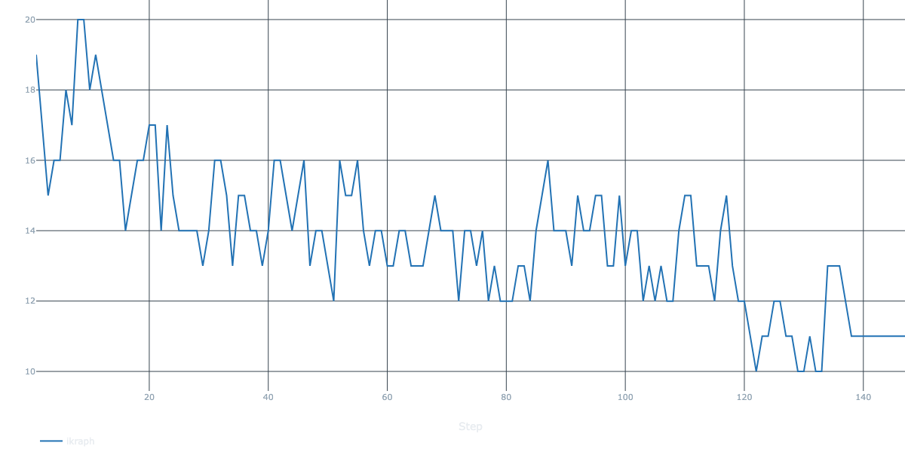
</p>
<p align="center"><em>
Realized active clusters (after argmax assignment) for the main run. After initial oscillations between ~10–20 clusters, the model stabilizes at 11 active clusters. This behavior reflects successful compression without degeneracy.
</em></p>
<p align="center">
    <b>Stability Test Realized Active Clusters (post-argmax)</b>
    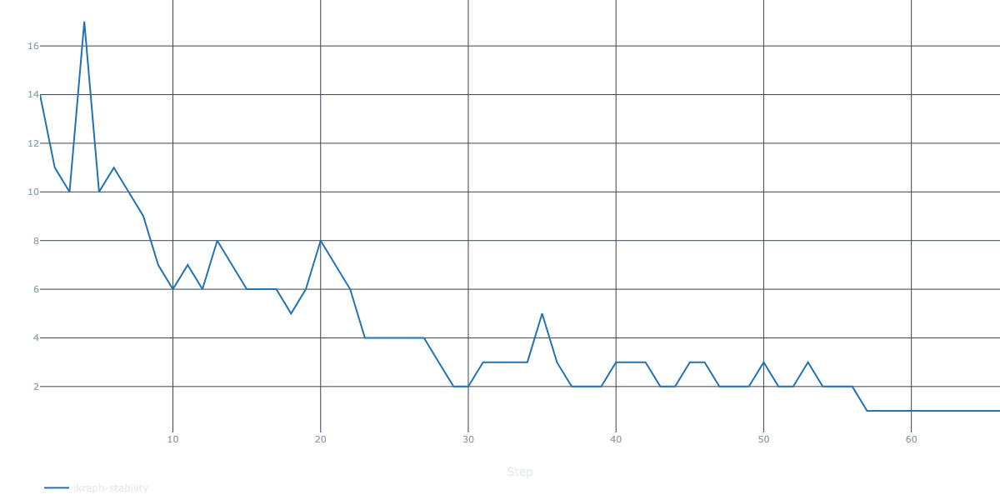
</p>
<p align="center"><em>
Realized clusters during the stability run. The model collapses to a single realized cluster by ~epoch 66 despite high-entropy gating. This confirms that the stability setup enforces excessive compression and masks finer structure.
</em></p>
<p align="center">
    <b>Number Active Clusters</b>
    
</p>
<p align="center"><em>
Number of active clusters (clusters receiving non-zero assignment mass pre-argmax) during the main run across epochs. The realized cluster count tracks this but shows a sharper convergence to 11 interpretable clusters. This provides evidence that hard assignments remain consistent with the soft assignment dynamics.
</em></p>
<p align="center">
    <b>Stability Test num Active Clusters</b>
    
</p>
<p align="center"><em>
Active cluster count during the stability retraining run. Despite initially exploring 60–70 clusters stochastically, the model collapses to two stable clusters early in training. This demonstrates that the stability-oriented regularization settings over-compress the latent space.
</em></p>
<p align="center">
    <b>Assignment Entropy</b>
    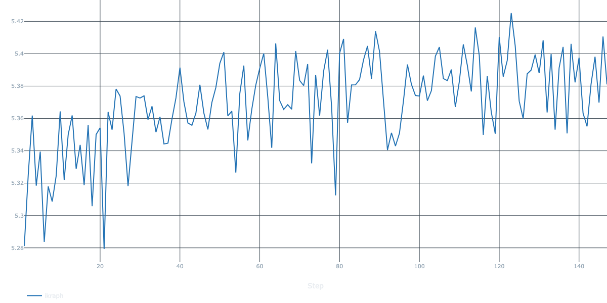
</p>
<p align="center"><em>
Assignment entropy quantifies how spread out each node’s membership distribution is, and the training loop keeps that spread above a target to prevent premature cluster collapse and to maintain capacity for later specialization. Entropy remains high for most of training and gradually sharpens as cluster usage stabilizes. This trajectory indicates that the model maintains diverse cluster assignments early on and only commits to a more structured latent organization near convergence.
</em></p>
<p align="center">
    <b>Stability Test Assignment Entropy</b>
    
</p>
<p align="center"><em>
Assignment entropy during the stability-focused retraining run. Despite entropy remaining high throughout, the model ultimately collapses to a small number of active clusters. This dissociation between high entropy and low realized cluster count highlights over-regularization in the stability configuration and motivates revisiting the bootstrap hyperparameters.
</em></p>
<p align="center">
    <b>Gate Entropy Bits</b>
    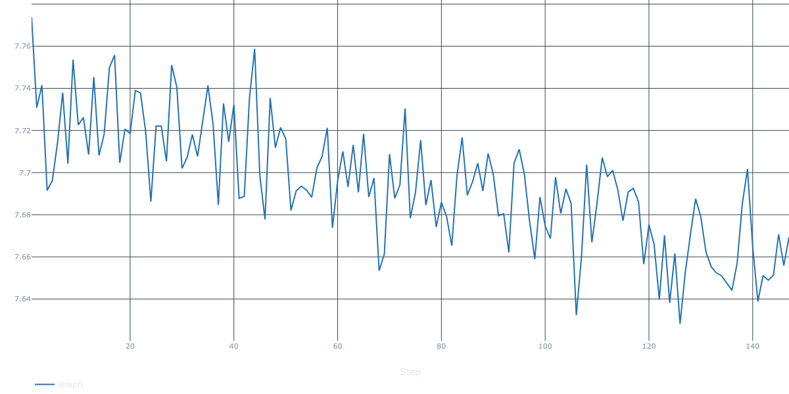
</p>
<p align="center"><em>
Gate entropy for the main run, reflecting the diversity of hard-concrete gate activations. Gate entropy stays elevated (≈7–8 bits), indicating that cluster gates remain broadly active and do not prematurely saturate—an important safeguard against early latent collapse.
</em></p>
<p align="center">
    <b>Stability Test Gate Entropy Bits</b>
    
</p>
<p align="center"><em>
Gate entropy across the stability run. Although gate entropy remains high, the model still converges to a nearly two-cluster solution, demonstrating that gate entropy alone is not a sufficient indicator of latent diversity under strong regularization pressure.
</em></p>
<p align="center">
    <b>Reconstruction Loss</b>
    
</p>
<p align="center"><em>
Reconstruction loss for the main RGCN-SCAE run, showing steady decline and smooth convergence. The decoder remains well-calibrated, and positive/negative logits track closely, indicating balanced learning of multiplex relations without memorization.
</em></p>
<p align="center">
    <b>Stability Test Reconstruction Loss</b>
    
</p>
<p align="center"><em>
Reconstruction loss during the stability run. Although this configuration achieves lower reconstruction loss than the main run, it does so by over-compressing the latent space, reflecting a known failure mode where high reconstruction performance coincides with collapsed cluster structure.
</em></p>
<p align="center">
    <b>Consistency Loss</b>
    
</p>
<p align="center"><em>
Memory-bank consistency loss for the main run that keeps embeddings aligned for nodes that reappear in multiple ego-net batches. The gradual decline reflects improving coherence of node embeddings across overlapping ego-net samples, indicating that repeated presentations of the same node converge toward stable latent representations.
</em></p>
<p align="center">
    <b>Stability Test Consistency Loss</b>
    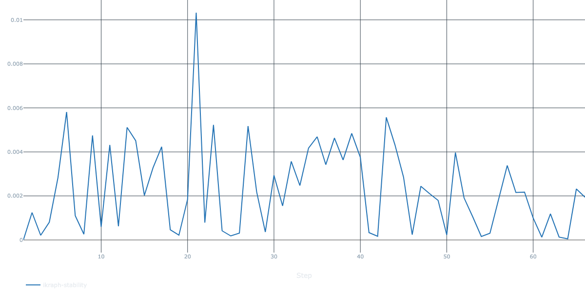
</p>
<p align="center"><em>
Consistency loss for the stability run. The elevated and noisier profile compared to the main run reflects competing pressures between negative-sampling calibration, entropy constraints, and excessive compression, further supporting the interpretation that the stability configuration induces a degenerate two-cluster solution.
</em></p>
<p align="center">
    <b>Encoder Clusters</b>
    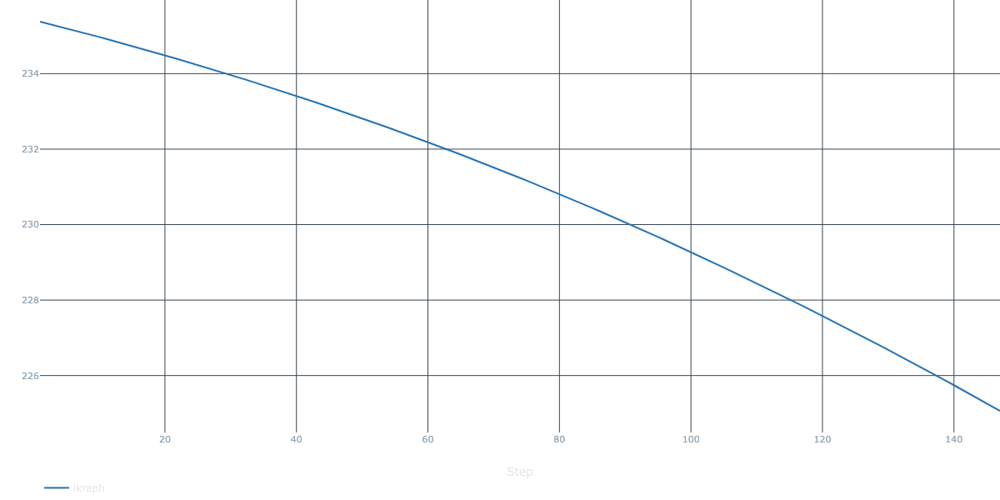
</p>
<p align="center"><em>
    This is the encoder-side sparsity metric computed as the expected L0 norm (i.e., probability mass of “on” gates) across all cluster-gate units in the SCAE encoder. It directly measures how many latent clusters the encoder is actively using at each step.
</em></p>
<p align="center">
    <b>Stability Test Encoder Clusters</b>
    
</p>
<p align="center"><em>

</em></p>
<p align="center">
    <b>Inter-Cluster Density</b>
    
</p>
<p align="center"><em>
    How many pairwise cluster interactions are contributing to reconstruction.
</em></p>
<p align="center">
    <b>Stability Test Inter-Cluster Density</b>
    
</p>
<p align="center"><em>
</p>
</em><p align="center">
    <b>Sparsity Warmup Factor</b>
    
</p>
<p align="center"><em>

</em></p>
<p align="center">
    <b>Stability Test Sparsity Warmup Factor</b>
    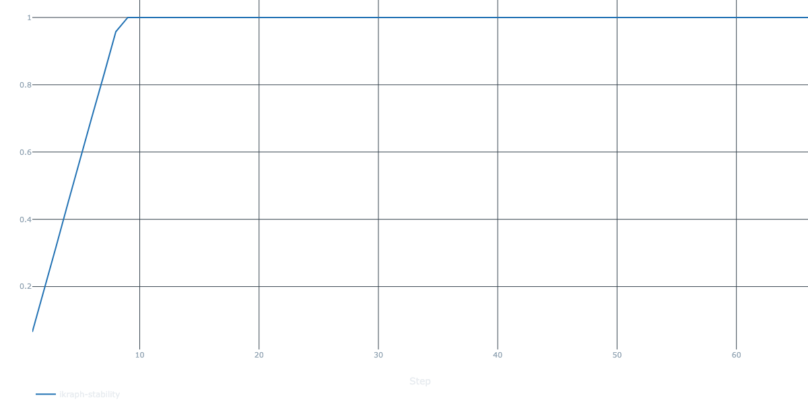
</p>
<p align="center"><em>
This is set from the model’s global step, not epochs but the x-axis here is epoch number. Every mini batch increments global step so the warmup happens more quickly compared to epoch number. This was a mistake that was missed and is a source of error in this study.
</em></p>

The above MLflow traces for the base RGCN-SCAE run and the stability-focused retraining provide an audit trail of the gate trajectories that underlie the preceding stability table.
The baseline model’s realized active clusters (how many clusters had at least one node assigned to it after the argmax) oscillated between ten and twenty before ending early at eleven clusters by epoch 147 due to the same number of realized active clusters for ten epochs consecutively, and its assignment entropy plateaued near 5.38 bits with gate entropy ≈7.65 bits.
In contrast, the stability run collapsed to a single realized cluster by epoch 66 even though stochastic sampling continued to touch 68–73 clusters and gate entropy remained ≈7.25 bits.
Plotting realized active clusters, num active clusters, and assignment entropy over epochs makes this divergence visually explicit and documents that the collapse occurred despite high-entropy gating, implying that the stopping criterion is insufficiently sensitive to emerging macro-clusters.
For full transparency, the remaining MLflow graphs are included in the appendix.

#### Calibration and Reconstruction Diagnostics
Calibration statistics show how pretraining choices constrained the stability experiment.
Decoder behavior mirrors this drift: the baseline model ended with overlapping positive/negative logits (means 0.424/0.423, standard deviations 0.003–0.005) while processing 6,704 negatives per batch, but the stability run pushed logits above 1.0/0.96 with an order-of-magnitude higher variance and only 1,206 negatives.
These distributions explain why the stability configuration attains a lower reconstruction loss (0.00120 vs. 0.00206) yet produces fewer populated clusters, and they motivate revising the negative-sampling ratio and calibration window when describing future experiments.

#### Regularization Burden
Loss decompositions clarify which constraints dominate optimization.
At convergence the stability run reports a consistency penalty of 1.9e-3 and a degree-penalty of 1.2e-3, roughly an order of magnitude larger than the corresponding 4.5e-7 and 1.1e-4 terms in the baseline run.
Conversely, the encoder/decoder sparsity penalties (`cluster_L0` = 150.1; `inter_L0` = 3.57e4) are substantially lower than the baseline’s 225.1 / 5.51e4, corroborating the qualitative observation that the stability regimen over-compresses the latent space.

## Discussion
This work demonstrates that it might be possible for a carefully curated multiplex knowledge graph, coupled with information-theoretic representation learning, to recover candidate transdiagnostic structure aligned with contemporary dimensional nosologies.
Separation of psychiatric labels during graph construction appears to preserve enough semantic signal for latent clustering to differentiate mechanistic, biomarker, and treatment-related subnetworks, supporting the hypothesis that diagnostic structure can emerge without direct supervision from DSM-era vocabularies.
The primary limitation of this interpretation is the quality of the knowledge graph used.
In the final graph used for partitioning, 11,114 of the 59,785 psychiatric nodes (18.6%) still carry HiTOP supervision and only 3,695 nodes (6.2%) retain RDoC supervision because removing those labels otherwise triggers graph degeneracy.
This residual supervision introduces the real possibility that alignment metrics partially reflect propagated diagnostic signal rather than entirely independent structural emergence.
Because 18.6% of psychiatric nodes carry HiTOP labels and 6.2% carry RDoC labels, the resulting clusters cannot be interpreted as fully unsupervised with respect to either taxonomy.
Consequently, alignment values may be upwardly biased, and the current results should be treated as an initial feasibility demonstration rather than evidence of strong or definitive convergence.
An important source of error that was noticed is the way that the stability test went through its allocated sparsity warmup factor relative to epoch number more quickly because every mini batch increments global step and the warmup factor is set from the global step.

Additionally, the use of only 64 bootstrapped samples instead of the planned 500 due to time constraints severely hinders the reliability of the stability analysis; the observed gate entropy of 0.885 bits (effective cluster count ≈1.85) indicates that the stability procedure converged prematurely to two clusters, so broader resampling is required to test whether richer structure survives.
The node-weighted coherence of 0.1607 ± 1.2e-5 (identical when weighted by log cluster size) shows that every bootstrap produced essentially the same pair of dense macro-clusters, so the reported stability metrics should be interpreted as a degenerate but highly repeatable solution rather than evidence of multi-cluster convergence.

The RGCN-SCAE partitioning already satisfies the central design goal of parsimony: eleven clusters cover the entire 59,786-node psychiatric subgraph, keeping the cluster-count ratio close to the label baselines while still capturing diverse semantics.
The node-weighted semantic coherence (0.18) is slightly higher than the SBM baseline despite the latter’s far greater cluster capacity, and the semantically derived coherence–F1 correlations indicate that tighter clusters consistently align better with HiTOP/RDoC (Spearman ≥0.79).
In contrast, the degree-corrected SBM explodes into 18,670 clusters (cluster-count ratio >2,000×) and consequently reports trivial per-cluster recall and F1, even though individual clusters can attain high precision.

Alignment metrics show complementary strengths.
Globally, the SBM achieves higher NMI because its many clusters can overfit to the reference labels, but the RGCN-SCAE delivers substantially better Adjusted Rand Index (0.112 vs. 0.016 for HiTOP) while using only ~0.06 % of the cluster count.
Per-cluster statistics amplify this divide: RGCN-SCAE maintains μ precision/recall of ~0.62/0.18 across its 8 labeled clusters, whereas the SBM’s ~18k clusters have μ precision near 0.99 but μ recall under 0.002, reflecting thousands of tiny, label-specific partitions.
Enrichment coverage mirrors this picture—62.5 % of RGCN-SCAE clusters that overlap HiTOP are significant after FDR correction, versus <1 % for the SBM.

The degree-corrected SBM’s expansion to 18,670 clusters is an expected consequence of applying a likelihood-maximizing block model to a sparse, heterogeneous, multiplex graph.
When edge densities vary dramatically across node types and degrees—as they do in this knowledge graph—the SBM achieves higher likelihood by carving the network into many small, highly specific micro-blocks rather than discovering broader transdiagnostic modules.
This behavior reflects the model’s parametric bias toward fine-grained partitions under heterogeneous degree distributions rather than meaningful mesoscale structure.
In contrast, the RGCN-SCAE’s self-compressing latent space forces a parsimonious representation that merges these micro-patterns into coherent, semantically enriched domains, thereby revealing structure that the SBM’s over-fragmentation obscures.

These findings reinforce the motivation for a self-compressing encoder: enforcing a modest latent capacity yields interpretable, semantically cohesive partitions that still recover known psychiatric dimensions.
They also highlight current limitations.
All 64 stability bootstraps collapsed to the same two macro-clusters (gate entropy 0.885 bits, effective cluster count ≈1.85, coherence 0.1607 ± 1.2e-5, ARI 0.164/0.022), so training is repeatable but presently over-compresses the latent space, likely due to the low number of bootstrap subgraph samples used for the stability test.
The log-size weighted coherence of about 0.160 indicates that both macro-clusters retain dense biomarker/treatment lexicons despite bootstrapped resampling.
Second, global alignments against HiTOP/RDoC remain moderate (NMI ≤0.20), implying that either the knowledge graph encodes additional structure beyond the reference taxonomies or the alignment pipeline still needs feature/domain refinements.
Third, the enrichment coverage numbers in the results expose that SBM’s seemingly broad label coverage comes from thousands of micro-clusters that together cover only ~0.4 % of RDoC-labeled nodes.
Finally, both methods rely on deterministic text-derived embeddings; improved biomedical encoders or ontology-augmented attribute sets could further tighten cluster coherence and downstream alignment.
In sum, the RGCN-SCAE already balances parsimony, semantic coherence, and statistically significant HiTOP/RDoC enrichment far better than the SBM baseline.

The main limitation of the method itself remains the vast hyperparameter surface for stabilizing training.
More than fifty continuous or categorical settings govern optimization, sparsity controls, entropy floors, Dirichlet priors, sampling budgets, and checkpoint criteria.
This flexibility guards against collapse on graphs with heterogeneous degree distributions, yet it inflates researcher degrees of freedom and impedes reproducibility.
Small shifts in initialization or search ranges often lead to materially different partitions, making it difficult to attribute observed structure to the data rather than to bespoke tuning.
Until this sensitivity is reduced, claims about convergence toward specific nosological frameworks must be treated as provisional.
Nevertheless, the ability to rerun the full pipeline as new literature arrives offers a path toward a continuously updating nosology, provided that calibration becomes more automated and that longitudinal drift is tracked explicitly.

Three further issues moderate interpretation.
First, the knowledge graph inherits coverage biases from biomedical literature: well-funded disorders and pathways dominate the edge set, while under-studied conditions remain sparsely connected.
Second, named-entity recognition and ontology linking remain imperfect; gaps in NER coverage or mislinked entities propagate directly into the graph and can distort downstream clusters.
Third, the partitioning is not anchored to clinical priors or outcome-driven constraints, and evaluation presently leans on internal diagnostics—loss trajectories, entropy trends, gate usage—without equally rigorous clinical or phenotypic benchmarks.
Consequently, even coherent latent clusters may not map cleanly onto patient-level outcomes or treatment response profiles, and efficacy against real-world clinical data has not yet been demonstrated.

## Conclusion
The current pipeline verifies that a self-compressing RGCN trained on a psychiatric knowledge graph can recover interpretable, statistically enriched partitions while using orders of magnitude fewer clusters than a degree-corrected SBM.
Nevertheless, two structural weaknesses limit the strength of that evidence: nosology nodes remain embedded in the graph because removing them destroys every edge, and stability estimates rely on only 64 bootstraps.
The highest priority for future work is validating similar results on a higher quality knowledge graph.
Specifically, incorporating non-disease seed pathways into the knowledge graph creation—for example, leveraging phenotype and side-effect modalities—will also be essential so that diagnostic labels can be removed without triggering degeneracy and the nosology filter can operate as originally intended.
Facing that requirement head-on will make downstream alignment to HiTOP/RDoC more meaningful because any correspondence will rest on structure inferred from symptoms, biomarkers, and interventions rather than residual DSM/ICD vocabulary.
An ablation study to test the effects of removing hyperparameters and their associated functionality would be the next most worthwhile area for future work so that it can be determined whether some hyperparameters can be safely removed.
Running the stability analysis with a larger number of bootstrap samples will also clarify whether the two-cluster collapse reflects over-regularization or genuine consensus structure.
The final step would be validating the learned clusters against external datasets (clinical cohorts, genomic assays) to determine their effectiveness in clinical applications.
Another interesting avenue for future work is adding causal or contrastive disentanglement objectives that carve structured latent axes would make clusters actionable rather than merely descriptive.
Weak supervision or contrastive pairs (for example, patients with the same diagnosis but divergent biomarker profiles) could anchor axes that predict treatment response or biological mechanisms, and diffusion-proximity positives (heat-kernel neighborhoods) paired with spectral-far negatives (similar to the approach outlined in [25]) would keep these constraints robust to degree heterogeneity.
Framing this as causal disentanglement of latent psychopathology representations from the multiplex graph would clarify which latent directions matter clinically and ensure that downstream interventions target the appropriate factors.
Addressing these constraints will clarify whether graph-based compression can support a durable, continuously updating psychiatric nosology.

## Abbreviations
- ARI = adjusted Rand index
- DSM = Diagnostic and Statistical Manual of Mental Disorders
- HiTOP = Hierarchical Taxonomy of Psychopathology
- ICD = International Classification of Diseases
- RDoC = Research Domain Criteria
- RGCN = Relational Graph Convolutional Network
- SBM = Stochastic Block Model
- SCAE = Self-Compressing Auto-Encoder

## References
1. R. Kotov et al., “The Hierarchical Taxonomy of Psychopathology (HiTOP): A dimensional alternative to traditional nosologies,” J. Abnorm. Psychol., vol. 126, no. 4, pp. 454–477, 2017.
1. N. Haslam, M. J. McGrath, W. Viechtbauer, and P. Kuppens, “Dimensions over categories: A meta-analysis of taxometric research,” Psychol. Med., vol. 50, no. 9, pp. 1418–1432, 2020.
1. B. N. Cuthbert and T. R. Insel, “Toward the future of psychiatric diagnosis: The seven pillars of RDoC,” BMC Med., vol. 11, no. 126, pp. 1–8, 2013.
1. R. Kapadia, R. R. Parikh, and A. G. Vahia, “Limitations of classification systems in psychiatry: Why DSM and ICD should be more dimensional, contextual, and culturally sensitive,” Dialogues Clin. Neurosci., vol. 22, no. 1, pp. 15–23, 2020.
1. A. Aftab and E. Ryznar, “Conceptual and historical evolution of psychiatric nosology,” Int. Rev. Psychiatry, vol. 33, no. 5, pp. 425–433, 2021.
1. L. Parkes, T. D. Satterthwaite, and D. S. Bassett, “Towards precise resting-state fMRI biomarkers in psychiatry: An overview of progress and open challenges,” arXiv preprint arXiv:2006.04728, 2020.
1. M. Goodkind et al., “Identification of a common neurobiological substrate for mental illness,” JAMA Psychiatry, vol. 72, no. 4, pp. 305–315, 2015.
1. W. R. Ringwald, H. R. Snyder, M. C. Keller, et al., “Meta-analysis of structural evidence for the Hierarchical Taxonomy of Psychopathology (HiTOP) model,” Psychol. Med., pp. 1–13, 2023.
1. D. Hirjak, R. C. Wolf, et al., “Linking clinical and biological insights to advance transdiagnostic psychiatry,” Biol. Psychiatry: Global Open Science, vol. 5, no. 1, pp. 14–27, 2025.
1. C. G. DeYoung, K. G. Patrick, et al., “The Hierarchical Taxonomy of Psychopathology (HiTOP) and the neurobiology of mental illness,” Front. Psychiatry, vol. 15, 2024, Art. no. 11529694.
1. A. Caspi and T. E. Moffitt, “All for one and one for all: Mental disorders in one dimension,” Am. J. Psychiatry, vol. 175, no. 9, pp. 831–844, 2018.
1. D. Bzdok and A. Meyer-Lindenberg, “Computational nosology and precision psychiatry,” Biol. Psychiatry, vol. 82, no. 6, pp. 421–430, 2017.
1. G. Starke, L. De Clercq, and F. Schülein, “Computational psychiatry: What do experts think?,” Biol. Psychiatry Global Open Sci., vol. 3, no. 3, pp. 305–313, 2023.
1. G. Zhou et al., “Classifying diseases by using biological features to identify potential nosological models,” Sci. Rep., vol. 11, no. 1, Art. no. 21613, 2021.
1. R. P. Roussel et al., “OMOP2OBO: Ontologizing health systems data at scale,” npj Digit. Med., vol. 6, no. 1, Art. no. 55, 2023.
1. L. Wang et al., “BIOS: An algorithmically generated biomedical knowledge graph,” arXiv preprint arXiv:2203.09975, 2022.
1. W. Wei et al., “NetMoST: A network-based machine learning approach for subtyping schizophrenia using polygenic SNP allele biomarkers,” arXiv preprint arXiv:2305.07005, 2023.
1. D. Drysdale et al., “Resting-state connectivity biomarkers define neurophysiological subtypes of depression,” Nat. Med., vol. 23, pp. 28–38, 2017.
1. Y. Benjamini and Y. Hochberg, "Controlling the false discovery rate: A practical and powerful approach to multiple testing," J. Roy. Statist. Soc. B (Methodological), vol. 57, no. 1, pp. 289–300, 1995.
1. Zhang, Y., Sui, X., Pan, F., Yu, K., Li, K., Tian, S., Erdengasileng, A., Han, Q., Wang, W., Wang, J., Wang, J., Sun, D., Chung, H., Zhou, J., Zhou, E., Lee, B., Zhang, P., Qiu, X., Zhao, T. & Zhang, J. (2025). A comprehensive large-scale biomedical knowledge graph for AI-powered data-driven biomedical research. Nature Machine Intelligence, 7, 602–614.
1. T. M. Sweet, A. C. Thomas, and B. W. Junker, “Hierarchical mixed membership stochastic blockmodels for multiple networks and experimental interventions,” in Handbook of Mixed Membership Models and Their Applications, E. Airoldi, D. Blei, E. Erosheva, and S. Fienberg, Eds. Boca Raton, FL, USA: Chapman & Hall/CRC Press, 2014, pp. 463–488.
1. M. Zaheer, S. Kottur, S. Ravanbakhsh, B. Poczos, R. Salakhutdinov, and A. Smola, “Deep Sets,” in Proc. 31st Conf. Neural Inf. Process. Syst. (NeurIPS), 2017, pp. 3391–3401.
1. C. Louizos, M. Welling, and D. P. Kingma, “Learning Sparse Neural Networks through L₀ Regularization,” arXiv preprint arXiv:1712.01312, 2017, presented at ICLR 2018.
1. W. B. Johnson, J. Lindenstrauss, and G. Schechtman, “Extensions of Lipschitz maps into Banach spaces,” Israel Journal of Mathematics, vol. 54, no. 2, pp. 129–138, May 1986.
1. Y. Li, Y. Zhang, and C. Liu, “MDGCL: Graph Contrastive Learning Framework with Multiple Graph Diffusion Methods,” Neural Processing Letters, vol. 56, art. no. 213, 2024. doi: 10.1007/s11063-024-11672-3

## Appendix
### Code Notes
- Install project requirements via `pip3.10 install -r requirements.txt`.
- Download the main data for the knowledge graph from https://zenodo.org/records/14851275/files/iKraph_full.tar.gz?download=1.
- If you want to include ontology augmentation (not used in final experiment), run
```
mkdir -p data/hpo
curl -L -o data/hpo/hp.obo https://purl.obolibrary.org/obo/hp.obo
curl -L -o data/hpo/phenotype.hpoa https://purl.obolibrary.org/obo/hp/hpoa/phenotype.hpoa
curl -L -o data/hpo/genes_to_phenotype.txt https://purl.obolibrary.org/obo/hp/hpoa/genes_to_phenotype.txt
python3.10 prepare_hpo_csv.py data/hpo/hp.obo data/hpo/phenotype.hpoa genes_to_phenotype.txt data/hpo/
```
to prepare the data used for augmenting the graph to prevent degeneracy after removing the diagnosis nodes and include the following CLI params in the below create_graph command:
```
--ontology-terms hpo=data/hpo/hpo_terms.csv \
--ontology-annotations hpo=data/hpo/hpo_annotations.csv \
--ontology-term-id-column hpo=id \
--ontology-term-name-column hpo=name \
--ontology-parent-column hpo=parents \
--ontology-annotation-entity-column hpo=entity \
--ontology-annotation-term-column hpo=term
```
- Run `python3.10 create_graph.py --ikraph-dir iKraph_full --output-prefix ikgraph` to create the graph before psych-relevance filtering.
- Run `python3.10 psy_filter_snapshot.py data/ikgraph.graphml --graphml-out data/ikgraph.filtered.graphml` to get final graph for training.
- MLflow is used for optional experiment tracking.
    - Enable tracking with MLflow by adding `--mlflow` (plus optional `--mlflow-tracking-uri`, `--mlflow-experiment`, `--mlflow-run-name`, and repeated `--mlflow-tag KEY=VALUE` flags) to `train_rgcn_scae.py`, which logs parameters, per-epoch metrics, and uploads the generated `partition.json` artifact as well as the traind model .pt file.
    - Metric explanations:
        - **total_loss** = weighted sum of reconstruction, sparsity, entropy, Dirichlet, embedding-norm, KL, consistency, gate-entropy, and degree penalties reported below.
        - **recon_loss** averages the BCE losses for positive and sampled negative edges per graph.
        - **sparsity_loss**, **cluster_l0**, **inter_l0** track the hard-concrete $L_0$ penalties that drive cluster/edge sparsity.
        - **entropy_loss** encourages per-graph assignment entropy to stay above `--assignment-entropy-floor`.
        - **dirichlet_loss** is the KL term that keeps mean cluster usage close to the Dirichlet prior.
        - **embedding_norm_loss** and **kld_loss** regularize latent vectors on a per-graph basis.
        - **degree_penalty** (with **degree_correlation_sq**) measures the decorrelation between latent norms and node degree.
        - **consistency_loss** / **consistency_overlap** are the memory-bank temporal consistency terms (0 when disabled).
        - **gate_entropy_bits** and **gate_entropy_loss** track how evenly decoder gates remain active.
        - **num_active_clusters** records the eval-mode gate count that matches the saved `partition.json`; **expected_active_clusters** is the summed HardConcrete $L_0$ expectation.
        - **realized_active_clusters** runs a full argmax pass and counts clusters that actually win nodes after enforcing `--min-cluster-size`.
        - **num_active_clusters_stochastic** retains the raw training-mode gate count when needing to debug EMA smoothing or gating noise.
        - **negative_confidence_weight** shows the entropy-driven reweighting applied when `--neg-entropy-scale > 0`.
        - **num_negatives** counts sampled negative edges that survived the per-graph cap.
        - **timing_sample_neg** and **timing_neg_logits** capture the wall-clock time (in seconds) spent sampling negatives and scoring them.
- The RGCN-SCAE trainer picks the latent cluster capacity automatically via `_default_cluster_capacity`, which grows sublinearly with node count (√N heuristic with a floor tied to relation count) to balance flexibility and memory usage.
- Use `python3.10 check_node_precision_recall.py --graph data/ikgraph.graphml --subset psychiatric --min-psy-score 0.33 --psy-include-neighbors 0` to report HiTOP/RDoC precision/recall over the exact node universe that survives the psychiatric filters. Add `--per-label-csv out/per_label_precision_recall.csv` if you need per-domain tables for manuscripts or diagnostics.
- Partition training supports resumable checkpoints via `train_rgcn_scae.py`.
    - Pass `--checkpoint-path PATH.pt` to atomically persist model weights, optimizer state, history, and run metadata at the end of training (and optionally every `--checkpoint-every N` epochs).
    - Resume an interrupted or completed run with `--resume-from-checkpoint --checkpoint-path PATH.pt`; add `--reset-optimizer` to reload only the model weights while reinitializing the optimizer.
    - Checkpoints store a signature of the graph/config and cumulative epoch counters so continued training logs consistent metrics (including MLflow) instead of restarting from epoch 1.
- Training stops early when the requested stability metric (realized_active_clusters by default) stays within tolerance for a sliding window of epochs. Pass `--cluster-stability-window` (number of epochs), `--cluster-stability-tolerance` (absolute span), and optionally `--cluster-stability-relative-tolerance` when calling `train_rgcn_scae.py`; once the chosen `stability_metric` (defaults to `realized_active_clusters`) varies less than both thresholds after `--min-epochs`, the run halts and records the stop epoch/reason in the history log.
- Run `python3.10 -m pytest` from the repository root to execute the regression tests for the extraction pipeline and training utilities.
- To compute results for a particular partitioning method, run `python3.10 align_partitions.py --graph data/ikgraph.filtered.graphml --partition <partitions_file>.json --prop-depth 1` and `python3.10 inspect_cluster.py --graph data/ikgraph.filtered.graphml --partition scae_partitions.json --explain --saliency --saliency-top-pair --outdir scae_inspect --cluster <clustere_num>`
    - `align_partitions.py` heuristically infers HiTOP/RDoC labels from node attributes when explicit maps are not supplied, so every derived metric (global alignment scores, enrichment CSV/JSON, coverage fractions) inherits those heuristics—rerunning the script is the authoritative way to reproduce the values reported in the Results tables.
- Regenerate the "Baseline Psychiatric Label Coverage" section via `python3.10 analysis/baseline_label_coverage.py --graph data/ikgraph.graphml --min-psy-score 0.33 --psy-include-neighbors 0`, which writes the intermediate JSON/CSV plus a Markdown table to `out/baseline_label_coverage.md`.

### Calibration
Everything below is calculated based on performance in the first 50 epochs:
- calibration_loss_curvature = 0 for both runs
- calibration_loss_slope = 0 for both runs
- main run calibration_mean_active_clusters = 245
- stability run calibration_mean_active_clusters = 120.454
- main run calibration_rel_var_active_clusters = 0
- stability run calibration_rel_var_active_clusters = .9
- main run calibration_var_active_clusters = 0
- stability run calibration_var_active_clusters = 12912.636

### Training Graphs
- Gate Entropy loss was permanently 0 for both runs.
<p align="center">
    <b>Consistency Overlap</b>
    
</p>
<p align="center"><em>

</em></p>
<p align="center">
    <b>Stability Test Consistency Overlap</b>
    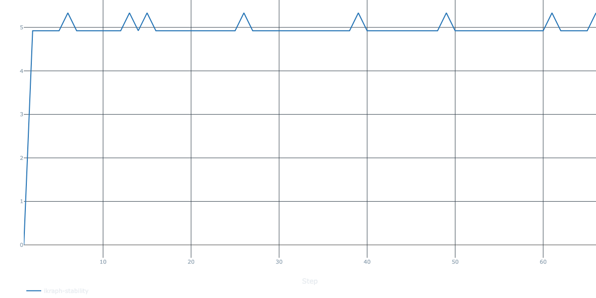
</p>
<p align="center"><em>

</em></p>
<p align="center">
    <b>Degree Correlation Squared</b>
    
</p>
<p align="center"><em>

</em></p>
<p align="center">
    <b>Stability Test Degree Correlation Squared</b>
    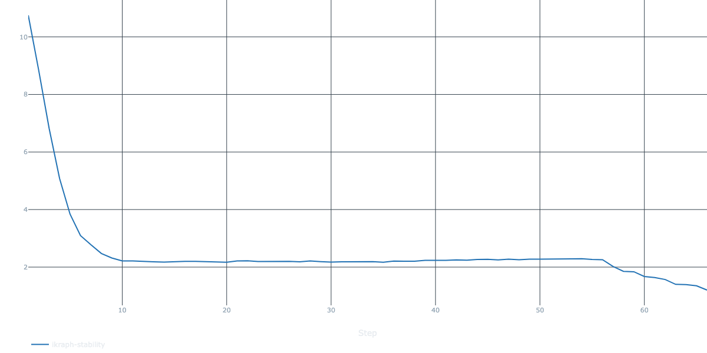
</p>
<p align="center"><em>

</em></p>
<p align="center">
    <b>Degree Penalty</b>
    
</p>
<p align="center"><em>

</em></p>
<p align="center">
    <b>Stability Test Degree Penalty</b>
    
</p>
<p align="center"><em>

</em></p>
<p align="center">
    <b>Dirichlet Loss</b>
    
</p>
<p align="center"><em>

</em></p>
<p align="center">
    <b>Stability Test Dirichlet Loss</b>
    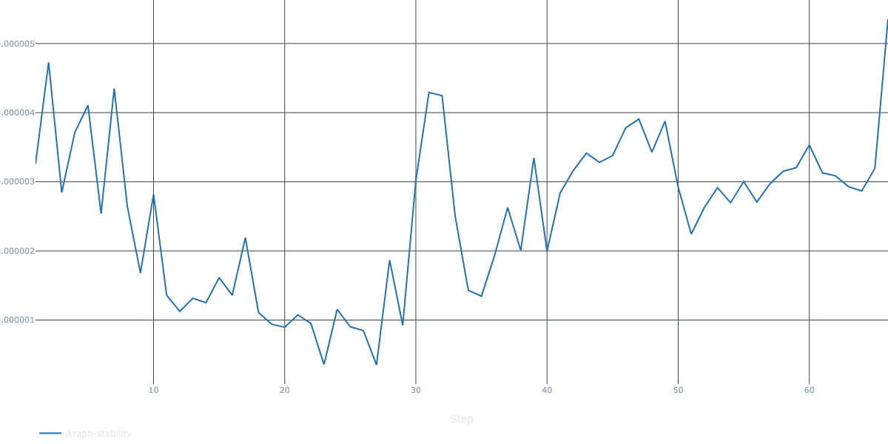
</p>
<p align="center"><em>

</em></p>
<p align="center">
    <b>Embedding Norm Loss</b>
    
</p>
<p align="center"><em>

</em></p>
<p align="center">
    <b>Stability Test Embedding Norm Loss</b>
    
</p>
<p align="center"><em>

</em></p>
<p align="center">
    <b>Entropy Loss</b>
    
</p>
<p align="center"><em>

</em></p>
<p align="center">
    <b>Stability Test Entropy Loss</b>
    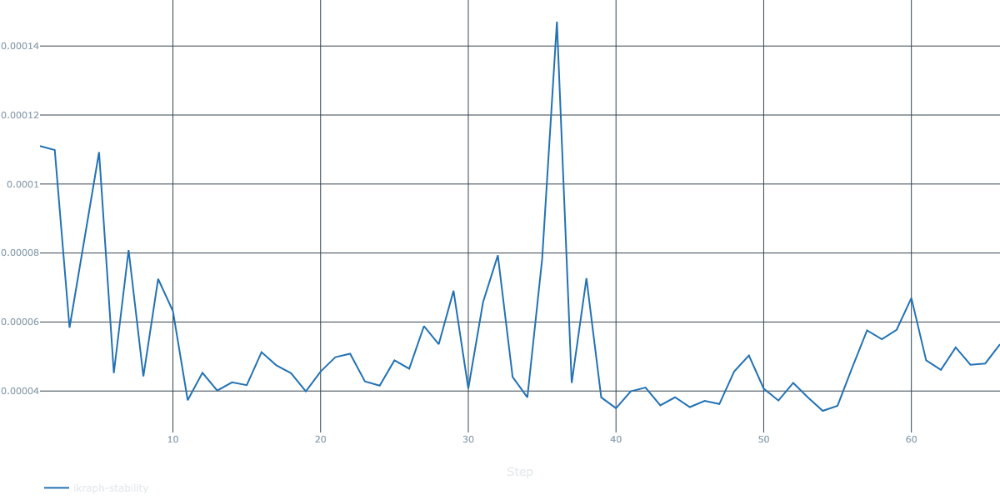
</p>
<p align="center"><em>

</em></p>
<p align="center">
    <b>KL Divergence Loss</b>
    
</p>
<p align="center"><em>

</em></p>
<p align="center">
    <b>Stability Test KL Divergence Loss</b>
    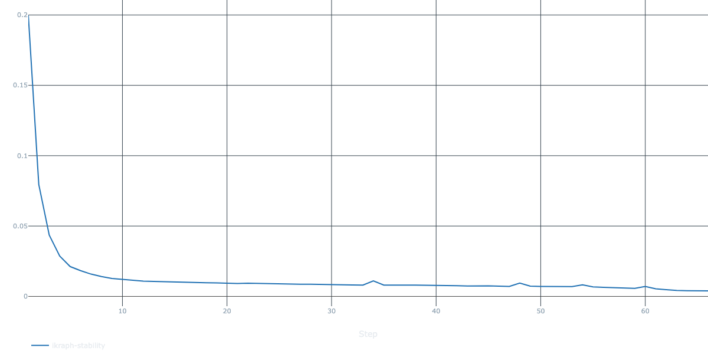
</p>
<p align="center"><em>

</em></p>
<p align="center">
    <b>Negative Logit Mean</b>
    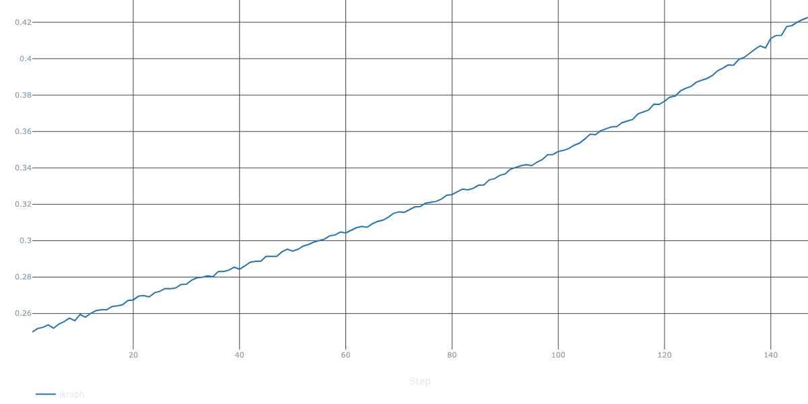
</p>
<p align="center"><em>

</em></p>
<p align="center">
    <b>Stability Test Negative Logit Mean</b>
    
</p>
<p align="center"><em>

</em></p>
<p align="center">
    <b>Negative Logit Standard Deviation</b>
    
</p>
<p align="center"><em>

</em></p>
<p align="center">
    <b>Stability Test Negative Logit Standard Deviation</b>
    
</p>
<p align="center"><em>

</em></p>
<p align="center">
    <b>Negative Confidence Weight</b>
    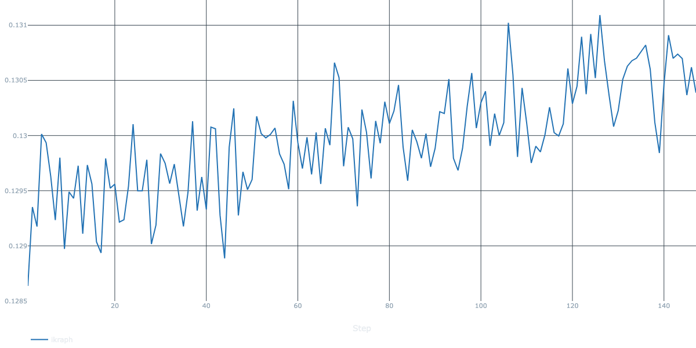
</p>
<p align="center"><em>

</em></p>
<p align="center">
    <b>Stability Test Negative Confidence Weight</b>
    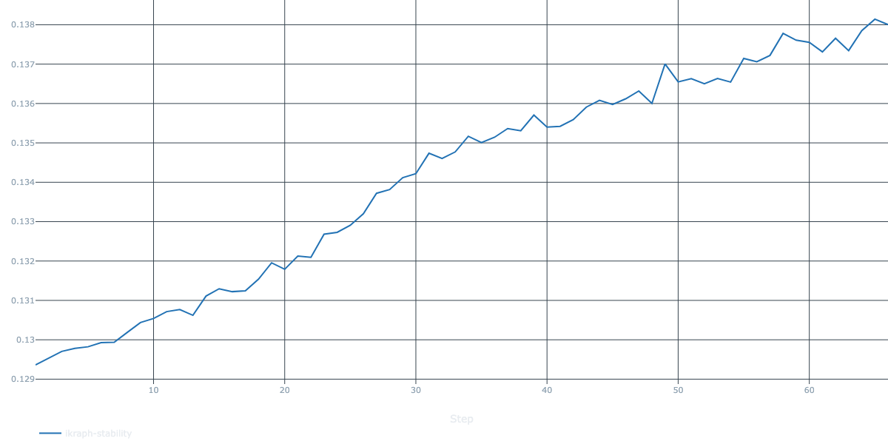
</p>
<p align="center"><em>

</em></p>
<p align="center">
    <b>Number Active Clusters Stochastic</b>
    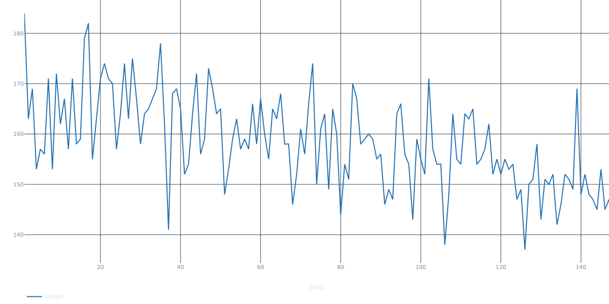
</p>
<p align="center"><em>

</em></p>
<p align="center">
    <b>Stability Test Number Active Clusters Stochastic</b>
    
</p>
<p align="center"><em>

</em></p>
<p align="center">
    <b>Number Negative Edges</b>
    
</p>
<p align="center"><em>

</em></p>
<p align="center">
    <b>Stability Test Number Negative Edges</b>
    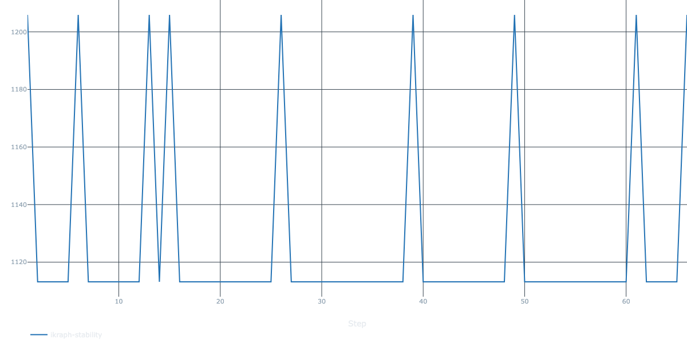
</p>
<p align="center"><em>

</em></p>
<p align="center">
    <b>Positive Logit Mean</b>
    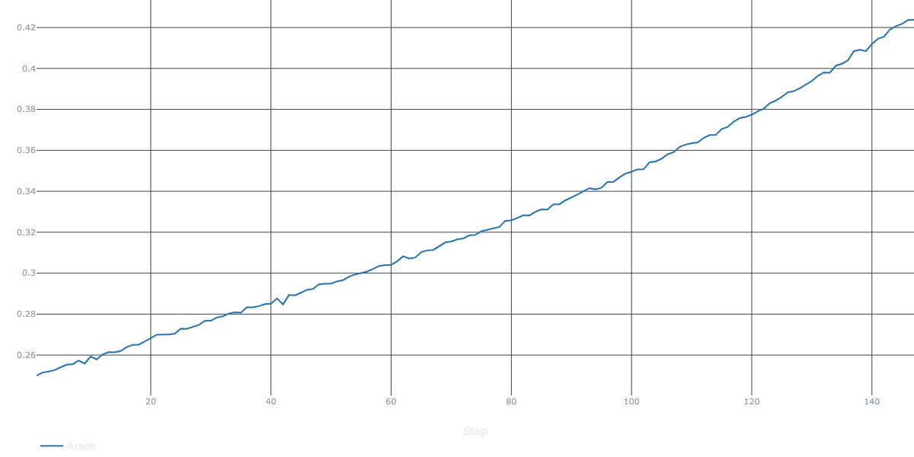
</p>
<p align="center"><em>

</em></p>
<p align="center">
    <b>Stability Test Positive Logit Mean</b>
    
</p>
<p align="center"><em>

</em></p>
<p align="center">
    <b>Positive Logit Standard Deviation</b>
    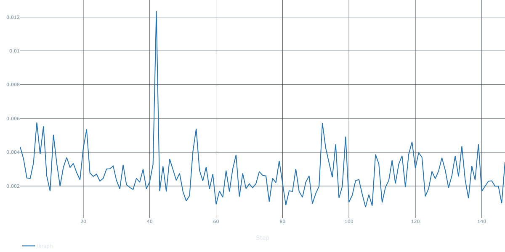
</p>
<p align="center"><em>

</em></p>
<p align="center">
    <b>Stability Test Positive Logit Standard Deviation</b>
    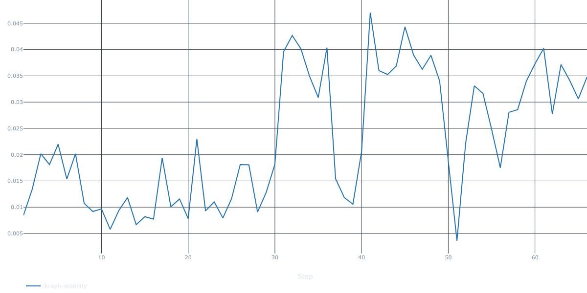
</p>
<p align="center"><em>

</em></p>
<p align="center">
    <b>Sparsity Loss</b>
    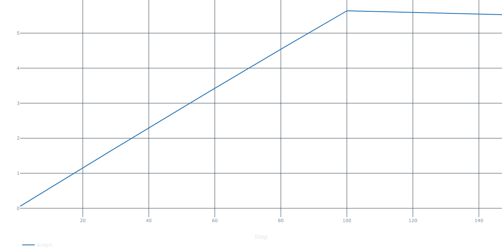
</p>
<p align="center"><em>

</em></p>
<p align="center">
    <b>Stability Test Sparsity Loss</b>
    
</p>
<p align="center"><em>

</em></p>
<p align="center">
    <b>Total Loss</b>
    
</p>
<p align="center"><em>

</em></p>
<p align="center">
    <b>Stability Test Total Loss</b>
    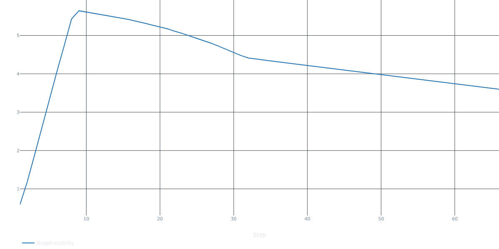
</p>
<p align="center"><em>

</em></p>
<p align="center">
    <b>Total Negative Edges</b>
    
</p>
<p align="center"><em>

</em></p>
<p align="center">
    <b>Stability Test Total Negative Edges</b>
    
</p>
<p align="center"><em>

</em></p>
<p align="center">
    <b>Total Positive Edges</b>
    
</p>
<p align="center"><em>

</em></p>
<p align="center">
    <b>Stability Test Total Positive Edges</b>
    
</p>
<p align="center"><em>

</em></p>
