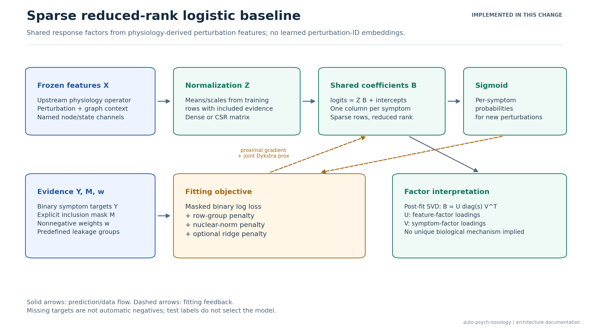
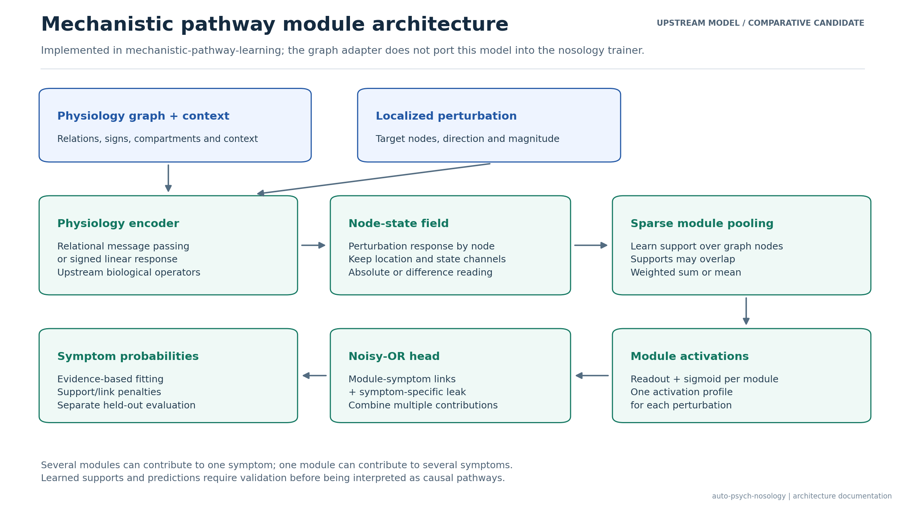
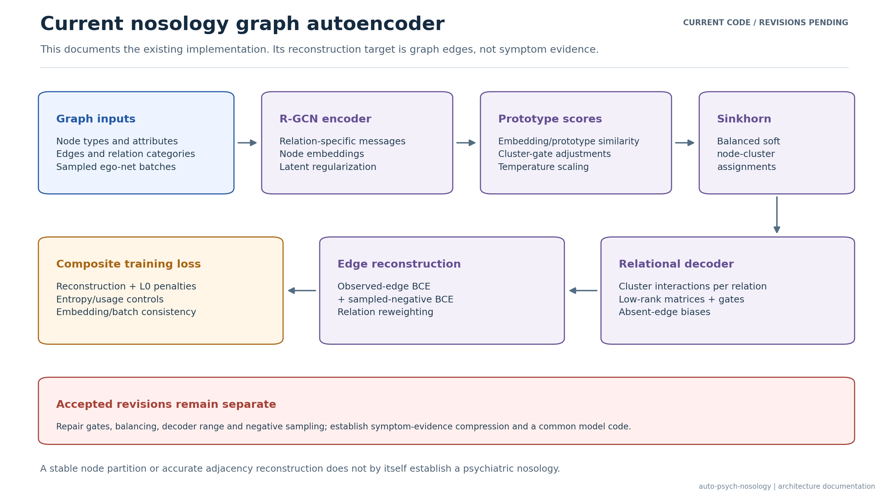

# Sparse reduced-rank logistic baseline

This baseline compresses perturbation-symptom relationships using a coefficient
matrix shared across symptoms. It consumes frozen physiology-derived features;
it does not reconstruct the original KG, infer diagnosis labels or duplicate the
physiology project's signed propagation and complex-handling operators.

## Architecture



For a perturbation feature matrix X, train-only feature means mu and scales sigma,
the standardized features are Z = (X - mu) / sigma. The prediction is

$$
P(Y_{ps}=1)=\frac{1}{1+e^{-(b_s+[ZB]_{ps})}}.
$$

B has one row per named graph feature and one column per symptom. It can be
decomposed after fitting as B = U Sigma V^T to inspect shared response factors.
Those factors are not independently fitted embeddings for perturbation IDs.
Graph-node, compartment and state-channel identities belong in the ordered
feature vocabulary; reducing the whole graph field to one sum before export
would discard those distinctions. Signed feature values are supported directly.



The second figure describes the upstream mechanistic model and its sparse
noisy-OR head. Importing graph data does not port this encoder or head into the
nosology trainer. It is a candidate comparative architecture, not a model
implemented by this baseline change.



The current nosology autoencoder remains a separate architecture. Its decoder
reconstructs graph edges, so its present loss is not a symptom-evidence
compression objective. Accepted revisions to its gates, balancing, decoder and
negative sampler remain separate work. This figure documents current code
rather than depicting those revisions as completed.

## Estimator and optimization

The implementation minimizes the convex objective

$$
\frac{\sum_{ps} M_{ps}w_{ps}\{
  \log(1+\exp(\eta_{ps}))-Y_{ps}\eta_{ps}\}}
 {\sum_{ps} M_{ps}w_{ps}}
 +\lambda_{\mathrm{row}}\sum_j\|B_{j,:}\|_2
 +\lambda_{\mathrm{rank}}\|B\|_*
 +\frac{\lambda_{\mathrm{ridge}}}{2}\|B\|_F^2,
\quad \eta=ZB+b.
$$

The row-group penalty removes complete feature rows. The nuclear norm, the sum
of singular values, reduces coefficient rank. Intercepts are unpenalized. Rank
emerges from the penalty; there is no fixed K or SCAD penalty in this estimator.
This is a convex sparse reduced-rank logistic variant, not a reproduction of the
specific estimator or published results of Park, Lee and Zhao.

Backtracking proximal gradient checks a smooth-loss upper bound and descent of
the full objective. Dykstra corrections solve the *joint* row-group/nuclear
proximal operator: performing the two threshold operations once does not solve
the sum-penalty problem. Optimization is deterministic. The convergence check
uses the proximal-gradient mapping, so a tiny backtracking step cannot falsely
establish convergence. Inspect `converged` before comparing a fitted result.

Dense and CSR inputs use the same estimator. Sparse feature standardization is
applied algebraically in matrix products, without densifying the feature matrix.
Rows with no positive-weight evidence are excluded from fitted preprocessing.
An unlabelled target is never made negative automatically. Even an entirely
unlabelled symptom is rejected at fitting time rather than given invented
training labels. A supplied negative or positive-unlabelled policy must be
explicit in the input artifact and applied consistently to every model.

## Python interface

```python
from sparse_rr_logistic import SparseReducedRankLogisticRegression

baseline = SparseReducedRankLogisticRegression(
    row_sparsity=0.01,
    nuclear_penalty=0.01,
    ridge_penalty=1e-4,
)
baseline.fit(
    training_features,
    training_binary_targets,
    observed_mask=training_observation_mask,
    evidence_weights=training_evidence_weights,
    feature_names=ordered_graph_feature_names,
    symptom_names=ordered_symptom_names,
)
validation_probabilities = baseline.predict_proba(
    validation_features,
    feature_names=ordered_graph_feature_names,
)
baseline.save("runs/sparse_rr/model.npz")
```

The numerical defaults are starting values, not empirically selected settings.
Choose them on development data after the final graph/evidence release. Never
select them using HiTOP/RDoC agreement or test labels. The same feature generator
and information boundary should be used when comparing readouts. Any learned
upstream feature generator must also be fitted inside the training split.

## Frozen input artifact

`run_sparse_rr_baseline.py` consumes an NPZ file loaded with `allow_pickle=False`.
It requires explicit feature identities, evidence masks and predefined leakage
groups. It does not choose symptoms, grade evidence or construct splits from
the current raw evidence tables. The feature producer is upstream; export a
fold-specific artifact after its encoder interface and release are frozen.

| Array | Shape / content |
| --- | --- |
| `features` | Dense float matrix `[perturbations, features]` |
| `feature_data`, `feature_indices`, `feature_indptr`, `feature_shape` | CSR representation instead of `features`; integer indices/pointers/shape |
| `targets` | Binary matrix `[perturbations, symptoms]`; ignored entries may be NaN |
| `observed_mask` | Boolean matrix of the same shape; entries included in the specified observation policy |
| `evidence_weights` | Nonnegative matrix of the same shape; zero excludes an entry |
| `perturbation_ids` | Unique strings in matrix-row order |
| `feature_names` | Unique strings in feature-column order |
| `symptom_names` | Unique strings in target-column order |
| `splits` | One of `train`, `validation` or `test` per row |
| `group_ids` | Nonempty leakage-group strings; a group cannot cross splits |
| `metadata_json` | Scalar JSON string as below |

```json
{
  "format_version": 1,
  "graph_snapshot_sha256": "<64 lowercase hexadecimal characters>",
  "feature_generator": {
    "name": "<upstream feature generator>",
    "configuration": {"<parameter>": "<value>"}
  },
  "feature_fit_perturbation_ids": []
}
```

List every row used to fit the upstream generator in
`feature_fit_perturbation_ids`; leave it empty only for a fixed operator. The
runner rejects IDs outside its training split. This declaration and the graph
pin record the producer's claims; they do not independently audit its internals.
Additional source hashes, encoder commits, evidence-selection policies and
context-channel definitions can be recorded in metadata and are retained.

To create an artifact from an upstream export:

```python
import json
import numpy as np

np.savez_compressed(
    "frozen_baseline_inputs.npz",
    features=physiology_perturbation_features,
    targets=selected_binary_targets,
    observed_mask=selected_observation_mask,
    evidence_weights=selected_evidence_weights,
    perturbation_ids=np.asarray(ordered_perturbation_ids, dtype=str),
    feature_names=np.asarray(ordered_graph_feature_names, dtype=str),
    symptom_names=np.asarray(ordered_symptom_names, dtype=str),
    splits=np.asarray(predefined_split_names, dtype=str),
    group_ids=np.asarray(predefined_leakage_group_ids, dtype=str),
    metadata_json=np.asarray(json.dumps(feature_provenance)),
)
```

## CLI and outputs

These are commands for the future frozen input, not experiments run for this PR:

```bash
python run_sparse_rr_baseline.py frozen_baseline_inputs.npz runs/sparse_rr_dev \
  --row-sparsity 0.01 --nuclear-penalty 0.01 --max-iter 1000 \
  --expected-graph-snapshot GRAPH_SNAPSHOT_SHA256
```

The runner fits training rows only. It reports training and validation log loss,
per-symptom average precision/AUROC, macro average precision and micro average
precision. Per-symptom ranking metrics require the configured minimum number of
positives (default five) and at least one negative. Micro average precision uses
all included pairs and requires both classes. These statistics describe the
chosen observation policy; they do not turn missing evidence into measured
negative outcomes.

Test probabilities are exported for later evaluation, but test targets and test
scores remain withheld unless `--evaluate-test` is supplied explicitly. The
command does not perform a hyperparameter sweep or run Hyperband.

Outputs are staged and published together into a new directory:

- `model.npz`: coefficients, intercepts, train-only normalization, vocabularies,
  optimizer configuration and convergence history; no pickle.
- `predictions.parquet`: held-out probabilities and permitted target fields.
- `report.json`: losses, ranking metrics, coefficient singular values/rank,
  active feature names, preprocessing/parameter counts and convergence status.
- `manifest.json`: input checksum, source metadata, split counts and output hashes.

Existing output directories are refused. Changing the input artifact during
fitting fails publication. Prediction requires the trained feature count and
checks ordered feature names when supplied.

## Description-length boundary

The report's `conditional_data_cost_bits` is the **unweighted** Bernoulli negative
log likelihood divided by log(2), evaluated on included targets. Fractional
evidence-weighted mean log loss is reported separately and is not called bits.
Neither the training penalties nor an NPZ file size is a complete MDL score.

Model coding remains part of the common experiment specification. It must
include support identities, coefficient/factor precision, intercepts,
normalization and any fitted upstream parameters. The saved model exposes those
parameters; no unsupported code length is manufactured here. If a quantized
model is used for coding, evaluate the data cost with that same decoded model.
Sparse and low-rank coefficients do not alone establish biological pathways or
identify a unique factorization. All validation in this change uses synthetic
correctness fixtures; no released research graph or evidence table was fitted.

## Sources and figures

- Park, Lee and Zhao (2024), [Low-rank regression models for multiple binary responses](https://doi.org/10.1080/01621459.2022.2105704).
- Natarajan and Dhillon (2014), [Inductive matrix completion for predicting gene-disease associations](https://doi.org/10.1093/bioinformatics/btu269).
- Combettes and Pesquet (2011), [Proximal splitting methods in signal processing](https://arxiv.org/abs/0912.3522).

Editable SVG and preview PNG versions are in `docs/figures`. Regenerate them with
`python scripts/render_architecture_figures.py` after installing
`requirements-figures.txt`.
